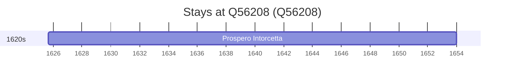

# Q56208

*(fetch error: HTTP Error 429: Too Many Requests)*

Wikidata: [Q56208](https://www.wikidata.org/wiki/Q56208)

1 occurrence(s) across 1 transcribed value(s), 1 person(s).

**Transcribed variants:**

- `Piazza Armerina, Sicília` (1×, 1625–1625)

| Date | Variant | Person | Type | Entity id | Real entity |
|------|---------|--------|------|-----------|-------------|
| 1625-08-28 | Piazza Armerina, Sicília | Prospero Intorcetta | nascimento | [deh-prospero-intorcetta](deh-prospero-intorcetta) | — |

