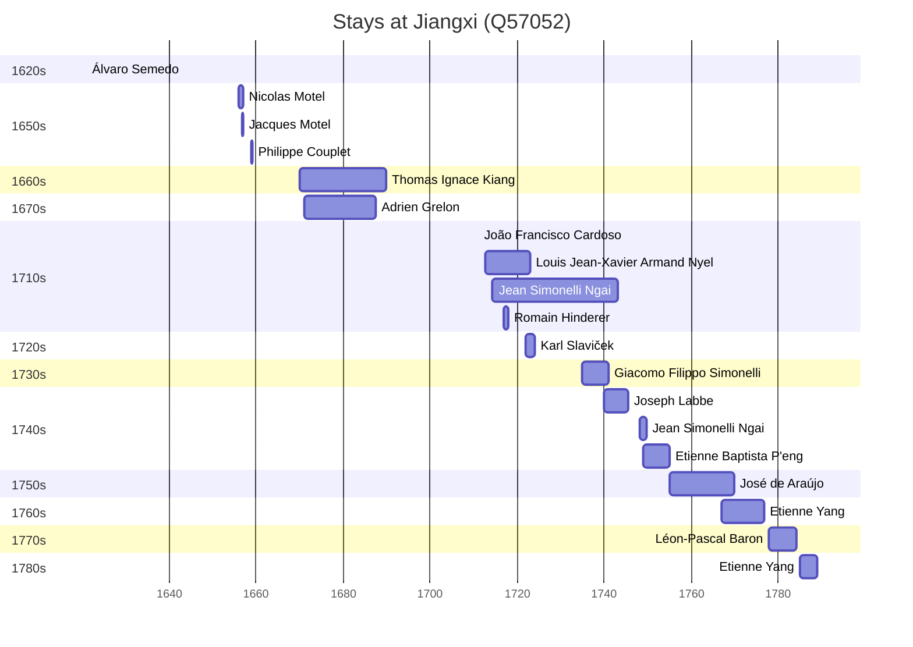

# Jiangxi (Q57052)

*province of central China, located around the Gan River south of the Yangtze*

Wikidata: [Q57052](https://www.wikidata.org/wiki/Q57052)

35 occurrence(s) across 2 transcribed value(s), 28 person(s).

**Transcribed variants:**

- `Kiang-si` (8×, 1621–1748)
- `Kiangsi` (27×, 1669–1798)

| Date | Variant | Person | Type | Entity id | Real entity |
|------|---------|--------|------|-----------|-------------|
| — | Kiangsi | Jean-Alexis de Gollet | estadia | [deh-jean-alexis-de-gollet](deh-jean-alexis-de-gollet) | — |
| — | Kiangsi | Jean-François Foucquet | estadia | [deh-jean-francois-foucquet](deh-jean-francois-foucquet) | — |
| — | Kiangsi | Joachim Bouvet | estadia | [deh-jean-francois-foucquet-ref1](deh-jean-francois-foucquet-ref1) | [rp407623](rp407623) |
| — | Kiangsi | Jean-Gaspard Chanseaume | estadia | [deh-jean-gaspard-chanseaume](deh-jean-gaspard-chanseaume) | — |
| — | Kiang-si | Jean Noëllas | estadia | [deh-jean-noellas](deh-jean-noellas) | — |
| — | Kiangsi | Jean Yao | estadia | [deh-jean-yao](deh-jean-yao) | — |
| — | Kiangsi | Joseph Le Quesne | estadia | [deh-joseph-le-quesne](deh-joseph-le-quesne) | — |
| — | Kiang-si | Louis Gobet | estadia | [deh-louis-gobet](deh-louis-gobet) | — |
| — | Kiangsi | Louis Porquet | estadia | [deh-louis-porquet](deh-louis-porquet) | [rp585015](rp585015) |
| — | Kiangsi | Pierre Vincent de Tartre | estadia | [deh-pierre-vincent-de-tartre](deh-pierre-vincent-de-tartre) | — |
| — | Kiangsi | Thomas Jean-Baptiste Lieou | estadia | [deh-thomas-jean-baptiste-lieou](deh-thomas-jean-baptiste-lieou) | — |
| 1621 | Kiang-si | Álvaro Semedo | estadia | [deh-alvaro-semedo](deh-alvaro-semedo) | — |
| 1656 | Kiang-si | Nicolas Motel | estadia | [deh-nicolas-motel](deh-nicolas-motel) | — |
| 1656-11-05 | Kiang-si | Jacques Motel | estadia | [deh-jacques-motel](deh-jacques-motel) | — |
| 1669-12-21 | Kiangsi | Thomas Ignace Kiang | nascimento | [deh-thomas-ignace-kiang](deh-thomas-ignace-kiang) | — |
| 1671 | Kiangsi | Adrien Grelon | estadia | [deh-adrien-grelon](deh-adrien-grelon) | — |
| 1687 | Kiangsi | Adrien Grelon | estadia | [deh-adrien-grelon](deh-adrien-grelon) | — |
| 1711 | Kiangsi | João Francisco Cardoso | estadia | [deh-joao-francisco-cardoso](deh-joao-francisco-cardoso) | — |
| 1712-08-19 | Kiangsi | Louis Jean-Xavier Armand Nyel | estadia | [deh-louis-jean-xavier-armand-nyel](deh-louis-jean-xavier-armand-nyel) | — |
| 1714-02-25 | Kiang-si | Jean Simonelli Ngai | nascimento | [deh-jean-simonelli-ngai](deh-jean-simonelli-ngai) | — |
| 1717 | Kiangsi | Romain Hinderer | estadia | [deh-romain-hinderer](deh-romain-hinderer) | — |
| 1722 | Kiangsi | Karl Slaviček | estadia | [deh-karl-slavicek](deh-karl-slavicek) | — |
| 1723 | Kiangsi | Karl Slaviček | estadia | [deh-karl-slavicek](deh-karl-slavicek) | — |
| 1735 | Kiang-si | Giacomo Filippo Simonelli | estadia | [deh-giacomo-filippo-simonelli](deh-giacomo-filippo-simonelli) | — |
| 1740 | Kiangsi | Joseph Labbe | estadia | [deh-joseph-labbe](deh-joseph-labbe) | — |
| 1748-01-28 | Kiang-si | Jean Simonelli Ngai | estadia | [deh-jean-simonelli-ngai](deh-jean-simonelli-ngai) | — |
| 1749 | Kiangsi | Etienne Baptista P'eng | estadia | [deh-etienne-baptista-peng](deh-etienne-baptista-peng) | — |
| 1755-04-21 | Kiangsi | Jean-Gaspard Chanseaume | morte | [deh-jean-gaspard-chanseaume](deh-jean-gaspard-chanseaume) | — |
| 1767 | Kiangsi | Etienne Yang | estadia | [deh-etienne-yang](deh-etienne-yang) | — |
| 1778 | Kiangsi | Léon-Pascal Baron | estadia | [deh-leon-pascal-baron](deh-leon-pascal-baron) | — |
| 1784-04-12 | Kiangsi | Léon-Pascal Baron | morte | [deh-leon-pascal-baron](deh-leon-pascal-baron) | — |
| 1785 | Kiangsi | Etienne Yang | estadia | [deh-etienne-yang](deh-etienne-yang) | — |
| 1798 | Kiangsi | Etienne Yang | morte | [deh-etienne-yang](deh-etienne-yang) | — |
| >1659 | Kiangsi | Philippe Couplet | estadia | [deh-philippe-couplet](deh-philippe-couplet) | [rp551005](rp551005) |
| >1755 | Kiangsi | José de Araújo | estadia | [deh-jose-de-araujo](deh-jose-de-araujo) | — |

### Co-presence

These persons were plausibly at this place during overlapping periods (interval estimation from stay dates; rough — see method note below).

| Period | Persons |
|--------|---------|
| 1650s | [Jacques Motel](deh-jacques-motel), [Nicolas Motel](deh-nicolas-motel) |
| 1670s | [Adrien Grelon](deh-adrien-grelon), [Thomas Ignace Kiang](deh-thomas-ignace-kiang) |
| 1710s | [Jean Simonelli Ngai](deh-jean-simonelli-ngai), [Louis Jean-Xavier Armand Nyel](deh-louis-jean-xavier-armand-nyel), [Romain Hinderer](deh-romain-hinderer) |
| 1720s | [Jean Simonelli Ngai](deh-jean-simonelli-ngai), [Karl Slaviček](deh-karl-slavicek), [Louis Jean-Xavier Armand Nyel](deh-louis-jean-xavier-armand-nyel) |
| 1730s | [Giacomo Filippo Simonelli](deh-giacomo-filippo-simonelli), [Jean Simonelli Ngai](deh-jean-simonelli-ngai) |
| 1740s | [Etienne Baptista P'eng](deh-etienne-baptista-peng), [Giacomo Filippo Simonelli](deh-giacomo-filippo-simonelli), [Jean Simonelli Ngai](deh-jean-simonelli-ngai), [Joseph Labbe](deh-joseph-labbe) |

*11 overlapping pair(s) involving 11 person(s). Method: interval start = stay event date; end = next embarque/partida/different-place event, or death, or +15yr cap.*

