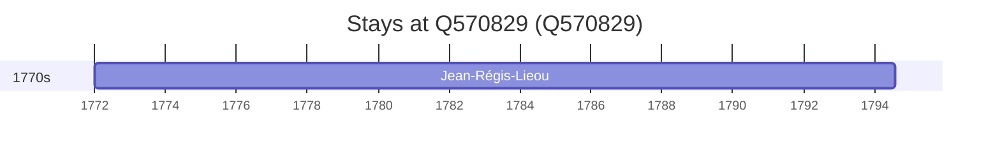

# Q570829

*(fetch error: HTTP Error 429: Too Many Requests)*

Wikidata: [Q570829](https://www.wikidata.org/wiki/Q570829)

1 occurrence(s) across 1 transcribed value(s), 1 person(s).

**Transcribed variants:**

- `Chihfeng (Tch'e-fong), Manchúria` (1×, 1772–1772)

| Date | Variant | Person | Type | Entity id | Real entity |
|------|---------|--------|------|-----------|-------------|
| 1772 | Chihfeng (Tch'e-fong), Manchúria | Jean-Régis-Lieou | estadia | [deh-jean-regis-lieou](deh-jean-regis-lieou) | [rp660632](rp660632) |

