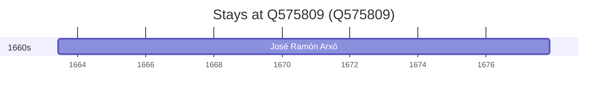

# Q575809

*(fetch error: HTTP Error 429: Too Many Requests)*

Wikidata: [Q575809](https://www.wikidata.org/wiki/Q575809)

1 occurrence(s) across 1 transcribed value(s), 1 person(s).

**Transcribed variants:**

- `Benasque, Huesca` (1×, 1663–1663)

| Date | Variant | Person | Type | Entity id | Real entity |
|------|---------|--------|------|-----------|-------------|
| 1663-06-06 | Benasque, Huesca | José Ramón Arxó | nascimento | [deh-jose-ramon-arxo](deh-jose-ramon-arxo) | — |

