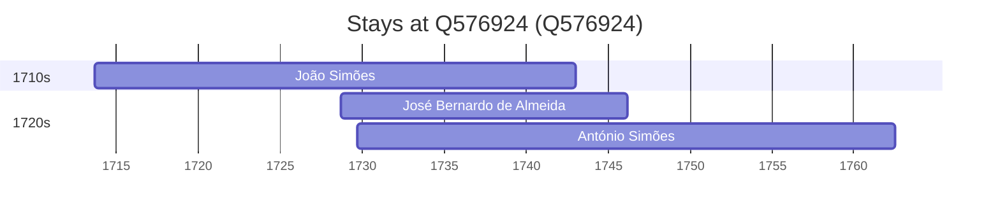

# Q576924

*(fetch error: HTTP Error 429: Too Many Requests)*

Wikidata: [Q576924](https://www.wikidata.org/wiki/Q576924)

3 occurrence(s) across 1 transcribed value(s), 3 person(s).

**Transcribed variants:**

- `Penela, diocese de Coimbra` (3×, 1713–1729)

| Date | Variant | Person | Type | Entity id | Real entity |
|------|---------|--------|------|-----------|-------------|
| 1713-09-08 | Penela, diocese de Coimbra | João Simões | nascimento | [deh-joao-simoes](deh-joao-simoes) | — |
| 1728-09-18 | Penela, diocese de Coimbra | José Bernardo de Almeida | nascimento | [deh-jose-bernardo-de-almeida](deh-jose-bernardo-de-almeida) | — |
| 1729-09-18 | Penela, diocese de Coimbra | António Simões | nascimento | [deh-antonio-simoes-iii](deh-antonio-simoes-iii) | — |

### Co-presence

These persons were plausibly at this place during overlapping periods (interval estimation from stay dates; rough — see method note below).

| Period | Persons |
|--------|---------|
| 1720s | [António Simões](deh-antonio-simoes-iii), [José Bernardo de Almeida](deh-jose-bernardo-de-almeida), [João Simões](deh-joao-simoes) |

*3 overlapping pair(s) involving 3 person(s). Method: interval start = stay event date; end = next embarque/partida/different-place event, or death, or +15yr cap.*

