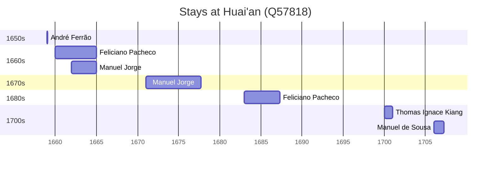

# Huai'an (Q57818)

*prefecture-level city in Jiangsu, China*

Wikidata: [Q57818](https://www.wikidata.org/wiki/Q57818)

8 occurrence(s) across 6 transcribed value(s), 5 person(s).

**Transcribed variants:**

- `Hwaian (Houaingan fou), Kiang-sou` (1×, 1659–1659)
- `Hwaian (Houai-ngan fou)` (1×, 1660–1660)
- `Hwaian (Houai-ngan)` (1×, 1662–1662)
- `Hwaian` (3×, 1671–1687)
- `Hwaian (Houai-ngan de Nanquim)` (1×, 1700–1700)
- `Hwaian fou, Kiang-nan` (1×, 1706–1706)

| Date | Variant | Person | Type | Entity id | Real entity |
|------|---------|--------|------|-----------|-------------|
| 1659 | Hwaian (Houaingan fou), Kiang-sou | André Ferrão | estadia | [deh-andre-ferrao](deh-andre-ferrao) | [rp773563](rp773563) |
| 1660 | Hwaian (Houai-ngan fou) | Feliciano Pacheco | estadia | [deh-feliciano-pacheco](deh-feliciano-pacheco) | — |
| 1662 | Hwaian (Houai-ngan) | Manuel Jorge | estadia | [deh-manuel-jorge](deh-manuel-jorge) | — |
| 1671 | Hwaian | Manuel Jorge | estadia | [deh-manuel-jorge](deh-manuel-jorge) | — |
| 1683 | Hwaian | Feliciano Pacheco | estadia | [deh-feliciano-pacheco](deh-feliciano-pacheco) | — |
| 1687-05 | Hwaian | Feliciano Pacheco | morte | [deh-feliciano-pacheco](deh-feliciano-pacheco) | — |
| 1700 | Hwaian (Houai-ngan de Nanquim) | Thomas Ignace Kiang | estadia | [deh-thomas-ignace-kiang](deh-thomas-ignace-kiang) | — |
| 1706 | Hwaian fou, Kiang-nan | Manuel de Sousa | estadia | [deh-manuel-de-sousa](deh-manuel-de-sousa) | — |

### Co-presence

These persons were plausibly at this place during overlapping periods (interval estimation from stay dates; rough — see method note below).

| Period | Persons |
|--------|---------|
| 1660s | [Feliciano Pacheco](deh-feliciano-pacheco), [Manuel Jorge](deh-manuel-jorge) |

*1 overlapping pair(s) involving 2 person(s). Method: interval start = stay event date; end = next embarque/partida/different-place event, or death, or +15yr cap.*

