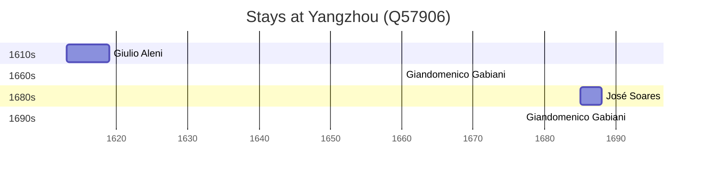

# Yangzhou (Q57906)

*prefecture-level city in Jiangsu, People's Republic of China*

Wikidata: [Q57906](https://www.wikidata.org/wiki/Q57906)

5 occurrence(s) across 3 transcribed value(s), 3 person(s).

**Transcribed variants:**

- `Yangchow` (3×, 1660–1692)
- `Yangchow fou` (1×, 1694–1694)
- `Yangchow, Yang-tcheou` (1×, undated)

| Date | Variant | Person | Type | Entity id | Real entity |
|------|---------|--------|------|-----------|-------------|
| 1660 | Yangchow | Giandomenico Gabiani | estadia | [deh-giandomenico-gabiani](deh-giandomenico-gabiani) | [rp565060](rp565060) |
| 1685 | Yangchow | José Soares | estadia | [deh-jose-soares](deh-jose-soares) | — |
| 1692 | Yangchow | Giandomenico Gabiani | estadia | [deh-giandomenico-gabiani](deh-giandomenico-gabiani) | [rp565060](rp565060) |
| 1694-10-24 | Yangchow fou | Giandomenico Gabiani | morte | [deh-giandomenico-gabiani](deh-giandomenico-gabiani) | [rp565060](rp565060) |
| >1613:<1619 | Yangchow, Yang-tcheou | Giulio Aleni | estadia | [deh-giulio-aleni](deh-giulio-aleni) | — |

