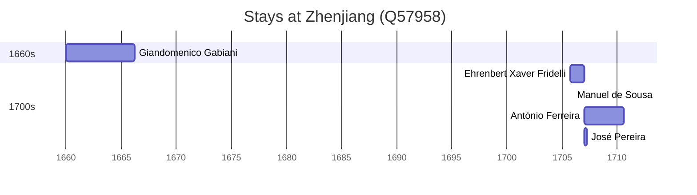

# Zhenjiang (Q57958)

*prefecture-level city in Jiangsu, China*

Wikidata: [Q57958](https://www.wikidata.org/wiki/Q57958)

6 occurrence(s) across 6 transcribed value(s), 5 person(s).

**Transcribed variants:**

- `Chinkiang` (1×, 1660–1660)
- `Chinkiang (Tchen-kiang), Kiangnan` (1×, 1705–1705)
- `Chinkiang (Tchen-kiang)` (1×, 1706–1706)
- `Chinkiang (Tchen-kiang fou)` (1×, 1707–1707)
- `Tchen-kiang fou` (1×, 1707–1707)
- `Tchen-kiang, Kiangsu` (1×, 1707–1707)

| Date | Variant | Person | Type | Entity id | Real entity |
|------|---------|--------|------|-----------|-------------|
| 1660 | Chinkiang | Giandomenico Gabiani | estadia | [deh-giandomenico-gabiani](deh-giandomenico-gabiani) | [rp565060](rp565060) |
| 1705-10-12 | Chinkiang (Tchen-kiang), Kiangnan | Ehrenbert Xaver Fridelli | estadia | [deh-ehrenbert-xaver-fridelli](deh-ehrenbert-xaver-fridelli) | — |
| 1706 | Chinkiang (Tchen-kiang) | Manuel de Sousa | estadia | [deh-manuel-de-sousa](deh-manuel-de-sousa) | — |
| 1707 | Chinkiang (Tchen-kiang fou) | António Ferreira | estadia | [deh-antonio-ferreira](deh-antonio-ferreira) | — |
| 1707 | Tchen-kiang, Kiangsu | José Pereira | estadia | [deh-jose-pereira](deh-jose-pereira) | — |
| 1707-03-27 | Tchen-kiang fou | José Pereira | jesuita-votos-local | [deh-jose-pereira](deh-jose-pereira) | — |

### Co-presence

These persons were plausibly at this place during overlapping periods (interval estimation from stay dates; rough — see method note below).

| Period | Persons |
|--------|---------|
| 1700s | [António Ferreira](deh-antonio-ferreira), [Ehrenbert Xaver Fridelli](deh-ehrenbert-xaver-fridelli), [José Pereira](deh-jose-pereira), [Manuel de Sousa](deh-manuel-de-sousa) |

*2 overlapping pair(s) involving 4 person(s). Method: interval start = stay event date; end = next embarque/partida/different-place event, or death, or +15yr cap.*

