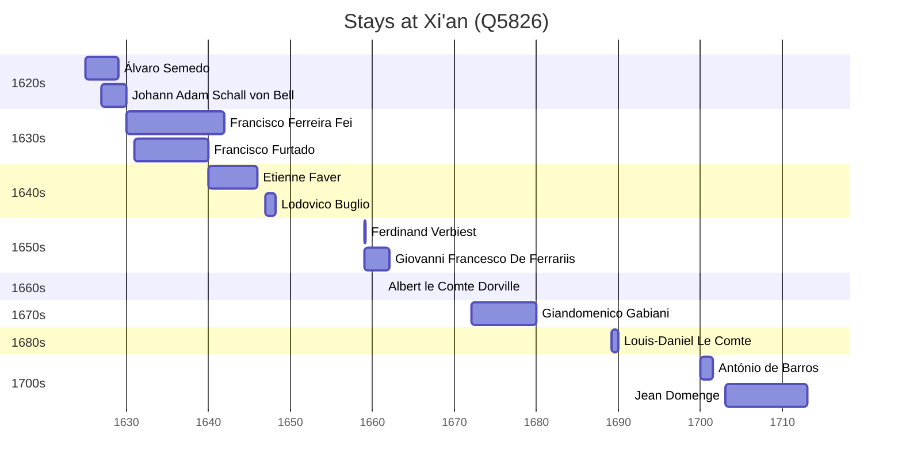

# Xi'an (Q5826)

*capital of Shaanxi Province, China*

Wikidata: [Q5826](https://www.wikidata.org/wiki/Q5826)

21 occurrence(s) across 12 transcribed value(s), 14 person(s).

**Transcribed variants:**

- `Sian (Si-ngan fou), Shensi` (3×, 1625–1712)
- `Sian (Si-ngan fou), Chen-si` (2×, 1627–1630)
- `Sian` (1×, 1628–1628)
- `Si-ngan fou, Chen-si` (1×, 1630–1630)
- `Sian (Si-ngan fou)` (6×, 1630–1700)
- `Sian (Si-ngan fou, residência)` (1×, 1631–1631)
- `Si gan fu` (1×, 1640–1640)
- `Sian (Si-ngan) fou` (2×, 1640–1646)
- `Sian, Si-ngan fou` (1×, 1647–1647)
- `Sian, Chen-si` (1×, 1659–1659)
- `Sian fou, Shensi` (1×, 1661–1661)
- `Si-ngan fou` (1×, 1689–1689)

| Date | Variant | Person | Type | Entity id | Real entity |
|------|---------|--------|------|-----------|-------------|
| 1625 | Sian (Si-ngan fou), Shensi | Álvaro Semedo | estadia | [deh-alvaro-semedo](deh-alvaro-semedo) | — |
| 1627 | Sian (Si-ngan fou), Chen-si | Johann Adam Schall von Bell | estadia | [deh-johann-adam-schall-von-bell](deh-johann-adam-schall-von-bell) | — |
| 1628-07-31 | Sian | Johann Adam Schall von Bell | jesuita-votos-local | [deh-johann-adam-schall-von-bell](deh-johann-adam-schall-von-bell) | — |
| 1630 | Sian (Si-ngan fou) | Francisco Ferreira Fei | estadia | [deh-francisco-ferreira-fei](deh-francisco-ferreira-fei) | — |
| 1630 | Sian (Si-ngan fou), Chen-si | Johann Adam Schall von Bell | estadia | [deh-johann-adam-schall-von-bell](deh-johann-adam-schall-von-bell) | — |
| 1630-10-03 | Si-ngan fou, Chen-si | Michel Trigault | partida | [deh-michel-trigault](deh-michel-trigault) | — |
| 1631 | Sian (Si-ngan fou, residência) | Francisco Furtado | estadia | [deh-francisco-furtado](deh-francisco-furtado) | — |
| 1634 | Sian (Si-ngan fou) | Francisco Ferreira Fei | estadia | [deh-francisco-ferreira-fei](deh-francisco-ferreira-fei) | — |
| 1640 | Sian (Si-ngan) fou | Etienne Faver | estadia | [deh-etienne-faber](deh-etienne-faber) | — |
| 1640-05-31 | Si gan fu | Etienne Faver | jesuita-votos-local | [deh-etienne-faber](deh-etienne-faber) | — |
| 1646 | Sian (Si-ngan) fou | Etienne Faver | estadia | [deh-etienne-faber](deh-etienne-faber) | — |
| 1647 | Sian, Si-ngan fou | Lodovico Buglio | estadia | [deh-lodovico-buglio](deh-lodovico-buglio) | — |
| 1659 | Sian, Chen-si | Ferdinand Verbiest | estadia | [deh-ferdinand-verbiest](deh-ferdinand-verbiest) | [rp339905](rp339905) |
| 1659 | Sian (Si-ngan fou) | Giovanni Francesco De Ferrariis | estadia | [deh-giovanni-francesco-de-ferrariis](deh-giovanni-francesco-de-ferrariis) | — |
| 1661-04-13 | Sian fou, Shensi | Albert le Comte Dorville | estadia | [deh-albert-le-comte-dorville](deh-albert-le-comte-dorville) | — |
| 1672 | Sian (Si-ngan fou) | Giandomenico Gabiani | estadia | [deh-giandomenico-gabiani](deh-giandomenico-gabiani) | [rp565060](rp565060) |
| 1680 | Sian (Si-ngan fou) | Giandomenico Gabiani | estadia | [deh-giandomenico-gabiani](deh-giandomenico-gabiani) | [rp565060](rp565060) |
| 1689-02 | Si-ngan fou | Louis-Daniel Le Comte | estadia | [deh-louis-daniel-le-comte](deh-louis-daniel-le-comte) | — |
| 1700 | Sian (Si-ngan fou) | António de Barros | estadia | [deh-antonio-de-barros](deh-antonio-de-barros) | — |
| 1703 | Sian (Si-ngan fou), Shensi | Jean Domenge | estadia | [deh-jean-domenge](deh-jean-domenge) | — |
| 1712 | Sian (Si-ngan fou), Shensi | Jean Domenge | estadia | [deh-jean-domenge](deh-jean-domenge) | — |

### Co-presence

These persons were plausibly at this place during overlapping periods (interval estimation from stay dates; rough — see method note below).

| Period | Persons |
|--------|---------|
| 1620s | [Johann Adam Schall von Bell](deh-johann-adam-schall-von-bell), [Álvaro Semedo](deh-alvaro-semedo) |
| 1630s | [Francisco Ferreira Fei](deh-francisco-ferreira-fei), [Francisco Furtado](deh-francisco-furtado) |
| 1640s | [Etienne Faver](deh-etienne-faber), [Francisco Ferreira Fei](deh-francisco-ferreira-fei) |
| 1650s | [Ferdinand Verbiest](rp339905), [Giovanni Francesco De Ferrariis](deh-giovanni-francesco-de-ferrariis) |
| 1660s | [Albert le Comte Dorville](deh-albert-le-comte-dorville), [Giovanni Francesco De Ferrariis](deh-giovanni-francesco-de-ferrariis) |

*5 overlapping pair(s) involving 8 person(s). Method: interval start = stay event date; end = next embarque/partida/different-place event, or death, or +15yr cap.*

