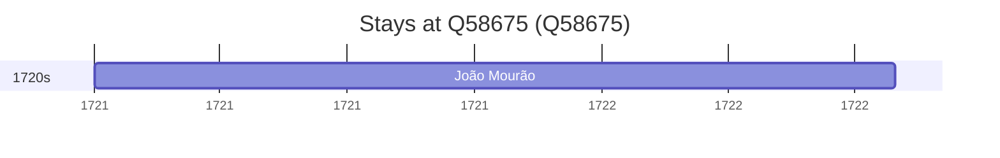

# Q58675

*(fetch error: HTTP Error 429: Too Many Requests)*

Wikidata: [Q58675](https://www.wikidata.org/wiki/Q58675)

2 occurrence(s) across 2 transcribed value(s), 2 person(s).

**Transcribed variants:**

- `Jéhol` (1×, 1716–1716)
- `Jehol` (1×, 1721–1721)

| Date | Variant | Person | Type | Entity id | Real entity |
|------|---------|--------|------|-----------|-------------|
| 1716-09-07 | Jéhol | Franz Thilisch | morte | [deh-franz-thilisch](deh-franz-thilisch) | — |
| 1721 | Jehol | João Mourão | estadia | [deh-joao-mourao](deh-joao-mourao) | — |

