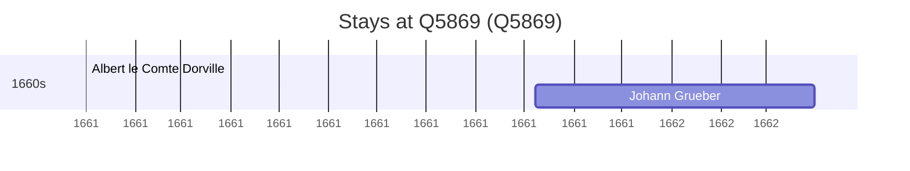

# Q5869

*(fetch error: HTTP Error 429: Too Many Requests)*

Wikidata: [Q5869](https://www.wikidata.org/wiki/Q5869)

3 occurrence(s) across 2 transcribed value(s), 2 person(s).

**Transcribed variants:**

- `Lhasa` (2×, 1661–1661)
- `Lhasa, Tibete` (1×, undated)

| Date | Variant | Person | Type | Entity id | Real entity |
|------|---------|--------|------|-----------|-------------|
| 1661-10-08 | Lhasa | Johann Grueber | estadia | [deh-johann-grueber](deh-johann-grueber) | — |
| 1661-11-08 | Lhasa | Johann Grueber | estadia | [deh-johann-grueber](deh-johann-grueber) | — |
| >1661 | Lhasa, Tibete | Albert le Comte Dorville | estadia | [deh-albert-le-comte-dorville](deh-albert-le-comte-dorville) | — |

