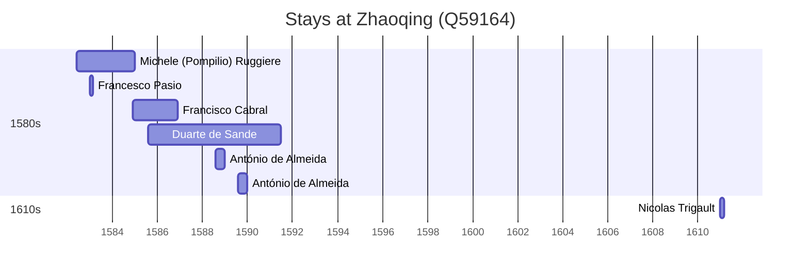

# Zhaoqing (Q59164)

*prefecture-level city in Guangdong, China*

Wikidata: [Q59164](https://www.wikidata.org/wiki/Q59164)

11 occurrence(s) across 5 transcribed value(s), 7 person(s).

**Transcribed variants:**

- `Shiuhing (Tchao-k'ing fou)` (2×, 1582–1583)
- `Tchao-k'ing fou (Shiuhing)` (4×, 1582–1610)
- `Shiuhing (Tchao-K'ing fou)` (1×, 1584–1584)
- `Tchao-k'ing fou` (2×, 1585–1587)
- `«Sciaochino» (Shiuhing, Tchao-k'ing), Kwangtung` (2×, 1588–1589)

| Date | Variant | Person | Type | Entity id | Real entity |
|------|---------|--------|------|-----------|-------------|
| 1582-06 | Tchao-k'ing fou (Shiuhing) | Michele (Pompilio) Ruggiere | estadia | [deh-michele-ruggiere](deh-michele-ruggiere) | — |
| 1582-12 | Tchao-k'ing fou (Shiuhing) | Michele (Pompilio) Ruggiere | estadia | [deh-michele-ruggiere](deh-michele-ruggiere) | — |
| 1582-12-27 | Shiuhing (Tchao-k'ing fou) | Francesco Pasio | estadia | [deh-francesco-pasio](deh-francesco-pasio) | — |
| 1583-01-01 | Tchao-k'ing fou (Shiuhing) | Michele (Pompilio) Ruggiere | estadia | [deh-michele-ruggiere](deh-michele-ruggiere) | — |
| 1583-09-10 | Shiuhing (Tchao-k'ing fou) | Matteo Ricci | estadia | [deh-matteo-ricci](deh-matteo-ricci) | [rp302155](rp302155) |
| 1584-11-21 | Shiuhing (Tchao-K'ing fou) | Francisco Cabral | estadia | [deh-francisco-cabral](deh-francisco-cabral) | [rp400649](rp400649) |
| 1585-08 | Tchao-k'ing fou | Duarte de Sande | estadia | [deh-duarte-de-sande](deh-duarte-de-sande) | — |
| 1587-11 | Tchao-k'ing fou | Duarte de Sande | estadia | [deh-duarte-de-sande](deh-duarte-de-sande) | — |
| 1588-08 | «Sciaochino» (Shiuhing, Tchao-k'ing), Kwangtung | António de Almeida | estadia | [deh-antonio-de-almeida](deh-antonio-de-almeida) | — |
| 1589-08 | «Sciaochino» (Shiuhing, Tchao-k'ing), Kwangtung | António de Almeida | estadia | [deh-antonio-de-almeida](deh-antonio-de-almeida) | — |
| 1610-12-21 | Tchao-k'ing fou (Shiuhing) | Nicolas Trigault | estadia | [deh-nicolas-trigault](deh-nicolas-trigault) | — |

### Co-presence

These persons were plausibly at this place during overlapping periods (interval estimation from stay dates; rough — see method note below).

| Period | Persons |
|--------|---------|
| 1580s | [António de Almeida](deh-antonio-de-almeida), [Duarte de Sande](deh-duarte-de-sande), [Francesco Pasio](deh-francesco-pasio), [Francisco Cabral](rp400649), [Michele (Pompilio) Ruggiere](deh-michele-ruggiere) |

*5 overlapping pair(s) involving 5 person(s). Method: interval start = stay event date; end = next embarque/partida/different-place event, or death, or +15yr cap.*

