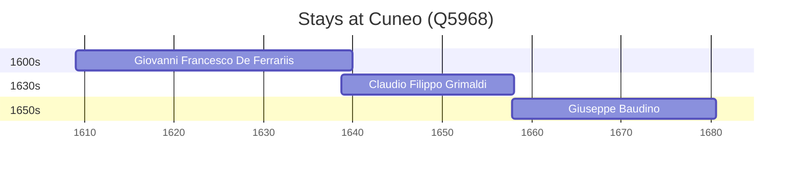

# Cuneo (Q5968)

*city and comune in Piedmont, Northern Italy*

Wikidata: [Q5968](https://www.wikidata.org/wiki/Q5968)

3 occurrence(s) across 1 transcribed value(s), 3 person(s).

**Transcribed variants:**

- `Cuneo, Piemonte` (3×, 1609–1657)

| Date | Variant | Person | Type | Entity id | Real entity |
|------|---------|--------|------|-----------|-------------|
| 1609 | Cuneo, Piemonte | Giovanni Francesco De Ferrariis | nascimento | [deh-giovanni-francesco-de-ferrariis](deh-giovanni-francesco-de-ferrariis) | — |
| 1638-09-27 | Cuneo, Piemonte | Claudio Filippo Grimaldi | nascimento | [deh-claudio-filippo-grimaldi](deh-claudio-filippo-grimaldi) | — |
| 1657-10-20 | Cuneo, Piemonte | Giuseppe Baudino | nascimento | [deh-giuseppe-baudino](deh-giuseppe-baudino) | — |

### Co-presence

These persons were plausibly at this place during overlapping periods (interval estimation from stay dates; rough — see method note below).

| Period | Persons |
|--------|---------|
| 1630s | [Claudio Filippo Grimaldi](deh-claudio-filippo-grimaldi), [Giovanni Francesco De Ferrariis](deh-giovanni-francesco-de-ferrariis) |
| 1650s | [Claudio Filippo Grimaldi](deh-claudio-filippo-grimaldi), [Giuseppe Baudino](deh-giuseppe-baudino) |

*2 overlapping pair(s) involving 3 person(s). Method: interval start = stay event date; end = next embarque/partida/different-place event, or death, or +15yr cap.*

