# Lisbon (Q597)

*municipality and capital city of Portugal*

Wikidata: [Q597](https://www.wikidata.org/wiki/Q597)

217 occurrence(s) across 8 transcribed value(s), 163 person(s).

**Transcribed variants:**

- `Lisboa` (177×, 1515–1781)
- `Lisboa (igreja de S. Roque)` (1×, 1655–1655)
- `Lisboa (casa professa)` (1×, 1746–1746)
- `Lisboa (Forte de S. Julião)` (33×, 1759–1777)
- `Prisão` (1×, 1761–1761)
- `Lisboa (prisão)` (2×, 1762–1765)
- `Lisboa (paróquia de Sta. Engrácia)` (1×, 1791–1791)
- `Roma` (1×, undated)

| Date | Variant | Person | Type | Entity id | Real entity |
|------|---------|--------|------|-----------|-------------|
| — | Lisboa | Diogo de Mesquita | estadia | [deh-diogo-de-mesquita](deh-diogo-de-mesquita) | — |
| — | Lisboa | François Noël | estadia | [deh-francois-noel](deh-francois-noel) | — |
| — | Lisboa | Joachim Calmes | estadia | [deh-joachim-calmes](deh-joachim-calmes) | — |
| — | Lisboa | João da Cunha | estadia | [deh-joao-da-cunha](deh-joao-da-cunha) | — |
| — | Lisboa | Johann Balthasar Staubach | estadia | [deh-johann-balthasar-staubach](deh-johann-balthasar-staubach) | — |
| — | Lisboa | Matias de Sousa | estadia | [deh-matias-de-sousa](deh-matias-de-sousa) | — |
| — | Lisboa | Sebastião Vieira | estadia | [deh-sebastiao-vieira](deh-sebastiao-vieira) | — |
| — | Lisboa | Valentim Stansel | estadia | [deh-valentim-stansel](deh-valentim-stansel) | — |
| 1515 | Lisboa | Baltasar Gago | nascimento | [deh-baltasar-gago](deh-baltasar-gago) | — |
| 1530 | Lisboa | Manuel Lopes Bulhão | nascimento | [deh-manuel-lopes-ref1](deh-manuel-lopes-ref1) | — |
| 1546 | Lisboa | Baltasar Gago | jesuita-entrada | [deh-baltasar-gago](deh-baltasar-gago) | — |
| 1546 | Lisboa | Baltasar Gago | jesuita-ordenacao-padre | [deh-baltasar-gago](deh-baltasar-gago) | — |
| 1551-02-01 | Lisboa | Manuel Teixeira | jesuita-entrada | [deh-manuel-teixeira](deh-manuel-teixeira) | [rp212210](rp212210) |
| 1551-03-11 | Lisboa | Melchior Dias | jesuita-entrada | [deh-melchor-diaz-ref1](deh-melchor-diaz-ref1) | — |
| 1553-10-01 | Lisboa | Tibúrcio de Quadros | jesuita-votos-local | [deh-tiburcio-de-quadros](deh-tiburcio-de-quadros) | — |
| 1553-10-01 | Lisboa | João III | estadia | [deh-tiburcio-de-quadros-ref1](deh-tiburcio-de-quadros-ref1) | — |
| 1559 | Lisboa | Valentim de Carvalho | nascimento | [deh-valentim-de-carvalho](deh-valentim-de-carvalho) | — |
| 1561 | Lisboa | António de Abreu | nascimento | [deh-antonio-de-abreu-ref1](deh-antonio-de-abreu-ref1) | — |
| 1562-06 | Lisboa | Duarte de Sande | jesuita-entrada | [deh-duarte-de-sande](deh-duarte-de-sande) | — |
| 1568 | Lisboa | Diogo Correia Valente | nascimento | [deh-diogo-correia-valente](deh-diogo-correia-valente) | — |
| 1569 | Lisboa | Mateus de Couros | nascimento | [deh-mateus-de-couros](deh-mateus-de-couros) | — |
| 1569 | Lisboa | André Palmeiro | nascimento | [deh-andre-palmeiro](deh-andre-palmeiro) | [rp983183](rp983183) |
| 1573-11-23 | Lisboa | Alessandro Valla | estadia | [deh-alessandro-valla](deh-alessandro-valla) | — |
| 1574-01-01 | Lisboa | Alessandro Valignano | estadia | [deh-alessandro-valignano](deh-alessandro-valignano) | — |
| 1575 | Lisboa | Juan Baptista de Ribera | estadia | [deh-juan-baptista-de-ribera](deh-juan-baptista-de-ribera) | — |
| 1577-10 | Lisboa | Melchior Dias | estadia | [deh-melchor-diaz-ref1](deh-melchor-diaz-ref1) | — |
| 1578-03-12 | Lisboa | Michele (Pompilio) Ruggiere | jesuita-ordenacao-padre | [deh-michele-ruggiere](deh-michele-ruggiere) | — |
| 1578-03-24 | Lisboa | Giovanni Gerardino | estadia | [deh-giovanni-gerardino](deh-giovanni-gerardino) | — |
| 1579-07-15 | Lisboa | Simão Rodrigues de Azevedo | morte | [deh-simao-rodrigues-de-azevedo](deh-simao-rodrigues-de-azevedo) | — |
| 1586-04-11 | Lisboa | Diogo de Mesquita | estadia | [deh-diogo-de-mesquita](deh-diogo-de-mesquita) | — |
| 1596-04-10 | Lisboa | Gil Martínez de la Mata | estadia | [deh-gil-martinez-de-la-mata](deh-gil-martinez-de-la-mata) | — |
| 1597 | Lisboa | Sebastião da Maia | nascimento | [deh-sebastiao-da-maia](deh-sebastiao-da-maia) | — |
| 1607 | Lisboa | Francisco Pereira | nascimento | [deh-francisco-pereira](deh-francisco-pereira) | — |
| 1611-03-20 | Lisboa | Pedro de Francisco | estadia | [deh-pedro-de-francisco](deh-pedro-de-francisco) | — |
| 1618-01-08 | Lisboa | Diogo Correia Valente | estadia | [deh-diogo-correia-valente](deh-diogo-correia-valente) | — |
| 1618-04 | Lisboa | Gabriel de Matos | estadia | [deh-gabriel-de-matos](deh-gabriel-de-matos) | — |
| 1618-04 | Lisboa | Nicolas Trigault | estadia | [deh-nicolas-trigault](deh-nicolas-trigault) | — |
| 1627-03-06 | Lisboa | Sebastião Vieira | estadia | [deh-sebastiao-vieira](deh-sebastiao-vieira) | — |
| 1627-04-06 | Lisboa | Francisco Ferreira | estadia | [deh-francisco-ferreira-fei-ref1](deh-francisco-ferreira-fei-ref1) | — |
| 1631 | Lisboa | Manuel Ferreyra | nascimento | [deh-manuel-ferreira-ref1](deh-manuel-ferreira-ref1) | — |
| 1632 | Lisboa | Francisco Nogueira | nascimento | [deh-francisco-nogueira](deh-francisco-nogueira) | — |
| 1632-02-02 | Lisboa | Matias de Sousa | jesuita-votos-local | [deh-matias-de-sousa](deh-matias-de-sousa) | — |
| 1634 | Lisboa | Manuel dos Reis | nascimento | [deh-manuel-dos-reis](deh-manuel-dos-reis) | — |
| 1639 | Lisboa | Reginaldo Burger | nascimento | [deh-reginaldo-burger](deh-reginaldo-burger) | — |
| 1640 | Lisboa | Álvaro Semedo | chegada | [deh-alvaro-semedo](deh-alvaro-semedo) | — |
| 1642 | Lisboa | Manuel Rodrigues | jesuita-entrada | [deh-manuel-rodrigues-ii-ref2](deh-manuel-rodrigues-ii-ref2) | — |
| 1646-08-09 | Lisboa | José Monteiro | nascimento | [deh-jose-monteiro](deh-jose-monteiro) | — |
| 1647-06-01 | Lisboa | Matias de Sousa | morte | [deh-matias-de-sousa](deh-matias-de-sousa) | — |
| 1648-02-01 | Lisboa | Francisco Pimentel | jesuita-entrada | [deh-francisco-pimentel](deh-francisco-pimentel) | — |
| 1649-04-15 | Lisboa | António Francisco Cardim | estadia | [deh-antonio-francisco-cardim](deh-antonio-francisco-cardim) | [rp536947](rp536947) |
| 1650-02-26 | Lisboa | Francisco da Veiga | jesuita-entrada | [deh-francisco-da-veiga](deh-francisco-da-veiga) | — |
| 1650-12-24 | Lisboa | António de Saldanha | jesuita-entrada | [deh-antonio-de-saldanha](deh-antonio-de-saldanha) | — |
| 1654-01-13 | Lisboa | António da Silva | nascimento | [deh-antonio-da-silva](deh-antonio-da-silva) | — |
| 1654-03-25 | Lisboa | Adrien Grelon | estadia | [deh-adrien-grelon](deh-adrien-grelon) | — |
| 1654-08-30 | Lisboa | Giandomenico Gabiani | partida | [deh-giandomenico-gabiani](deh-giandomenico-gabiani) | [rp565060](rp565060) |
| 1655-02 | Lisboa | Louis Gobet | partida | [deh-louis-gobet](deh-louis-gobet) | — |
| 1655-03-12 | Lisboa (igreja de S. Roque) | Jacques Motel | jesuita-votos-local | [deh-jacques-motel](deh-jacques-motel) | — |
| 1655-03-12 | Lisboa | Nicolas Motel | jesuita-votos-local | [deh-nicolas-motel](deh-nicolas-motel) | — |
| 1655-03-23 | Lisboa | Christophe Cloche | estadia | [deh-christophe-cloche](deh-christophe-cloche) | — |
| 1655-03-23 | Lisboa | Domenico Fuciti | estadia | [deh-domenico-fuciti](deh-domenico-fuciti) | — |
| 1655-03-23 | Lisboa | Edmond Poncet | estadia | [deh-edmond-poncet](deh-edmond-poncet) | — |
| 1655-03-23 | Lisboa | Germain Macret | estadia | [deh-germain-macret](deh-germain-macret) | — |
| 1655-03-23 | Lisboa | Giandomenico Gabiani | estadia | [deh-giandomenico-gabiani](deh-giandomenico-gabiani) | [rp565060](rp565060) |
| 1655-03-23 | Lisboa | Ignace Baudet de Beauregard | estadia | [deh-ignace-baudet-de-beauregard](deh-ignace-baudet-de-beauregard) | — |
| 1655-03-23 | Lisboa | Edmond Poncet | estadia | [deh-ignace-baudet-de-beauregard-ref1](deh-ignace-baudet-de-beauregard-ref1) | — |
| 1655-03-23 | Lisboa | Germain Macret | estadia | [deh-ignace-baudet-de-beauregard-ref2](deh-ignace-baudet-de-beauregard-ref2) | — |
| 1655-03-23 | Lisboa | Domenico Fuciti | estadia | [deh-ignace-baudet-de-beauregard-ref3](deh-ignace-baudet-de-beauregard-ref3) | — |
| 1655-03-23 | Lisboa | Jacques Motel | estadia | [deh-jacques-motel](deh-jacques-motel) | — |
| 1655-03-23 | Lisboa | Claude Motel | estadia | [deh-jacques-motel-irmao-1](deh-jacques-motel-irmao-1) | — |
| 1655-03-23 | Lisboa | Nicolas Motel | estadia | [deh-jacques-motel-irmao-2](deh-jacques-motel-irmao-2) | — |
| 1655-03-23 | Lisboa | Joseph François Tissanier | estadia | [deh-jacques-motel-ref10](deh-jacques-motel-ref10) | — |
| 1655-03-23 | Lisboa | Pierre Albier | estadia | [deh-jacques-motel-ref4](deh-jacques-motel-ref4) | — |
| 1655-03-23 | Lisboa | Edmond Poncet | estadia | [deh-jacques-motel-ref5](deh-jacques-motel-ref5) | — |
| 1655-03-23 | Lisboa | Christophe Cloche | estadia | [deh-jacques-motel-ref6](deh-jacques-motel-ref6) | — |
| 1655-03-23 | Lisboa | Ignace Baudet de Beauregard | estadia | [deh-jacques-motel-ref7](deh-jacques-motel-ref7) | — |
| 1655-03-23 | Lisboa | Germain Macret | estadia | [deh-jacques-motel-ref8](deh-jacques-motel-ref8) | — |
| 1655-03-23 | Lisboa | Jean Forget | estadia | [deh-jacques-motel-ref9](deh-jacques-motel-ref9) | — |
| 1655-03-23 | Lisboa | Jean Forget | estadia | [deh-jean-forget](deh-jean-forget) | — |
| 1655-03-23 | Lisboa | Joseph François Tissanier | estadia | [deh-joseph-francois-tissanier](deh-joseph-francois-tissanier) | — |
| 1655-03-23 | Lisboa | Louis Gobet | estadia | [deh-louis-gobet](deh-louis-gobet) | — |
| 1655-03-23 | Lisboa | Nicolas Motel | estadia | [deh-nicolas-motel](deh-nicolas-motel) | — |
| 1655-03-23 | Lisboa | Pierre Albier | estadia | [deh-pierre-albier](deh-pierre-albier) | — |
| 1655-04-16 | Lisboa | Francisco da Veiga | estadia | [deh-francisco-da-veiga](deh-francisco-da-veiga) | — |
| 1656 | Lisboa | João Nunes | morte | [deh-joao-nunes-ref2](deh-joao-nunes-ref2) | — |
| 1656-01-08 | Lisboa | Martino Martini | partida | [deh-martino-martini](deh-martino-martini) | — |
| 1656-05-30 | Lisboa | Michael-Pierre Boym | estadia | [deh-michael-pierre-boym](deh-michael-pierre-boym) | — |
| 1656-07-23 | Lisboa | Reginaldo Burger | jesuita-entrada | [deh-reginaldo-burger](deh-reginaldo-burger) | — |
| 1657-03-23 | Lisboa | Jean Brandi | estadia | [deh-jean-brandi](deh-jean-brandi) | — |
| 1658 | Lisboa | José de Almeida | nascimento | [deh-jose-de-almeida-ii](deh-jose-de-almeida-ii) | — |
| 1660-10-27 | Lisboa | André Fernandes | morte | [deh-andre-fernandes-ii-ref1](deh-andre-fernandes-ii-ref1) | — |
| 1662 | Lisboa | António da Costa | nascimento | [deh-antonio-da-costa-iii](deh-antonio-da-costa-iii) | — |
| 1662 | Lisboa | Manuel Camaya | nascimento | [deh-manuel-camaya](deh-manuel-camaya) | — |
| 1664-11-04 | Lisboa | Carlos de Resende | nascimento | [deh-carlos-de-resende](deh-carlos-de-resende) | — |
| 1665 | Lisboa | Nicolau da Fonseca | jesuita-entrada | [deh-nicolau-da-fonseca](deh-nicolau-da-fonseca) | — |
| 1665-08-25 | Lisboa | Luís de França | nascimento | [deh-luis-de-franca](deh-luis-de-franca) | — |
| 1666-04-15 | Lisboa | Francisco da Veiga | estadia | [deh-francisco-da-veiga](deh-francisco-da-veiga) | — |
| 1666-04-15 | Lisboa | Manuel de Siqueira Tcheng | estadia | [deh-manuel-de-siqueira-tcheng](deh-manuel-de-siqueira-tcheng) | [rp166098](rp166098) |
| 1667-10-10 | Lisboa | Manuel da Mata | nascimento | [deh-manuel-da-mata](deh-manuel-da-mata) | — |
| 1668 | Lisboa | Michel Alfonso Chen | jesuita-entrada | [deh-michel-alfonso-chen](deh-michel-alfonso-chen) | — |
| 1671 | Lisboa | Domingos Álvares | jesuita-entrada | [deh-domingos-alvares](deh-domingos-alvares) | — |
| 1671-10-09 | Lisboa | António Ferreira | nascimento | [deh-antonio-ferreira](deh-antonio-ferreira) | — |
| 1671-11-27 | Lisboa | João Duarte | nascimento | [deh-joao-duarte](deh-joao-duarte) | — |
| 1674-01-29 | Lisboa | Félix-José Pereira | nascimento | [deh-felix-jose-pereira](deh-felix-jose-pereira) | — |
| 1674-01-29 | Lisboa | José Pereira | nascimento | [deh-jose-pereira](deh-jose-pereira) | — |
| 1677 | Lisboa | Francisco Rodrigues | nascimento | [deh-francisco-rodrigues-ref2](deh-francisco-rodrigues-ref2) | — |
| 1677 | Lisboa | Manuel de Sousa | nascimento | [deh-manuel-de-sousa](deh-manuel-de-sousa) | — |
| 1677-02-24 | Lisboa | Matias Correa | nascimento | [deh-matias-correa](deh-matias-correa) | — |
| 1678 | Lisboa | Antoine Thomas | estadia-x | [deh-antoine-thomas](deh-antoine-thomas) | [rp486350](rp486350) |
| 1678-02-11 | Lisboa | Diogo Vidal | jesuita-entrada | [deh-diogo-vidal](deh-diogo-vidal) | — |
| 1680-02-18 | Lisboa | Carlos de Resende | jesuita-entrada | [deh-carlos-de-resende](deh-carlos-de-resende) | — |
| 1680-08-25 | Lisboa | Luís de França | jesuita-entrada | [deh-luis-de-franca](deh-luis-de-franca) | — |
| 1681-11-02 | Lisboa | António da Costa | jesuita-entrada | [deh-antonio-da-costa-iii](deh-antonio-da-costa-iii) | — |
| 1684-04-24 | Lisboa | Matias Correa | jesuita-entrada | [deh-matias-correa](deh-matias-correa) | — |
| 1685-10 | Lisboa | Giuseppe Candone | estadia | [deh-giuseppe-candone](deh-giuseppe-candone) | — |
| 1686-06-15 | Lisboa | Domingos Magalhães | jesuita-entrada | [deh-domingos-magalhaes](deh-domingos-magalhaes) | — |
| 1687-06-30 | Lisboa | José Pacheco | jesuita-entrada | [deh-jose-pacheco](deh-jose-pacheco) | — |
| 1687-12 | Lisboa | Manuel Ferreyra | estadia | [deh-manuel-ferreira-ref1](deh-manuel-ferreira-ref1) | — |
| 1688-02-28 | Lisboa | Pedro Zuzarte | morte | [deh-pedro-zuzarte](deh-pedro-zuzarte) | — |
| 1688-03-26 | Lisboa | João de Sá | jesuita-entrada | [deh-joao-de-sa](deh-joao-de-sa) | — |
| 1688-04-20 | Lisboa | Francesco Maria Spinola | estadia | [deh-francesco-maria-spinola](deh-francesco-maria-spinola) | [rp574322](rp574322) |
| 1689 | Lisboa | Francesco Maria Spinola | estadia | [deh-francesco-maria-spinola](deh-francesco-maria-spinola) | [rp574322](rp574322) |
| 1689-02-17 | Lisboa | Francisco Cordes | nascimento | [deh-francisco-de-cordes](deh-francisco-de-cordes) | — |
| 1690-01-14 | Lisboa | José Pereira | jesuita-entrada | [deh-jose-pereira](deh-jose-pereira) | — |
| 1690-04-08 | Lisboa | Alessandro Cicero | estadia | [deh-alessandro-cicero](deh-alessandro-cicero) | [rp532453](rp532453) |
| 1690-07-02 | Lisboa | Caetano Lopes | nascimento | [deh-caetano-lopes](deh-caetano-lopes) | — |
| 1691-11-22 | Lisboa | Marcos Silveiro | jesuita-entrada | [deh-marcos-silveiro](deh-marcos-silveiro) | — |
| 1692-11-06 | Lisboa | Cristoforo Fiori | jesuita-entrada | [deh-cristoforo-fiori](deh-cristoforo-fiori) | — |
| 1693 | Lisboa | António Xavier Tchang | estadia | [deh-antonio-xavier-ref2](deh-antonio-xavier-ref2) | — |
| 1693-03-20 | Lisboa | António Ferreira | jesuita-entrada | [deh-antonio-ferreira](deh-antonio-ferreira) | — |
| 1698-01-22 | Lisboa | João Mourão | jesuita-entrada | [deh-joao-mourao](deh-joao-mourao) | — |
| 1699-07-15 | Lisboa | Pedro de Meireles | jesuita-entrada | [deh-pedro-de-meireles](deh-pedro-de-meireles) | — |
| 1702-09-12 | Lisboa | Miguel Vieira | jesuita-entrada | [deh-miguel-vieira](deh-miguel-vieira) | — |
| 1706 | Lisboa | François Noël | estadia | [deh-francois-noel](deh-francois-noel) | — |
| 1707-06-13 | Lisboa | António-José Henriques | nascimento | [deh-antonio-jose-henriques](deh-antonio-jose-henriques) | — |
| 1709-04-08 | Lisboa | Franz Thilisch | estadia | [deh-franz-thilisch](deh-franz-thilisch) | — |
| 1709-09-08 | Lisboa | Paulo de Mesquita | jesuita-entrada | [deh-paulo-de-mesquita](deh-paulo-de-mesquita) | — |
| 1710-03 | Lisboa | João Francisco Cardoso | estadia | [deh-joao-francisco-cardoso](deh-joao-francisco-cardoso) | — |
| 1710-08-15 | Lisboa | João de Seixas | nascimento | [deh-joao-de-seixas](deh-joao-de-seixas) | — |
| 1716-03-14 | Lisboa | Pedro de Figueiredo | estadia | [deh-pedro-de-figueiredo-ii](deh-pedro-de-figueiredo-ii) | — |
| 1716-08-31 | Lisboa | Félix da Rocha | nascimento | [deh-felix-da-rocha](deh-felix-da-rocha) | — |
| 1717-09-08 | Lisboa | João de Loureiro | nascimento | [deh-joao-de-loureiro](deh-joao-de-loureiro) | — |
| 1718 | Lisboa | Emmanuel Josephus | jesuita-entrada | [deh-manuel-jose-ref2](deh-manuel-jose-ref2) | — |
| 1720-10-09 | Lisboa | Dionísio Ferreira | nascimento | [deh-dionisio-ferreira](deh-dionisio-ferreira) | — |
| 1721-05-01 | Lisboa | António Pires | nascimento | [deh-antonio-pires](deh-antonio-pires) | — |
| 1722-02-02 | Lisboa | Domingos Pinheiro | jesuita-votos-local | [deh-domingos-pinheiro](deh-domingos-pinheiro) | — |
| 1725-08-08 | Lisboa | Agostinho de Avellar | nascimento | [deh-agostinho-de-avellar](deh-agostinho-de-avellar) | — |
| 1725-10-01 | Lisboa | Miguel do Amaral | chegada | [deh-miguel-do-amaral](deh-miguel-do-amaral) | [rp086368](rp086368) |
| 1728-04-22 | Lisboa | Manuel de Sá | morte | [deh-manuel-de-sa](deh-manuel-de-sa) | — |
| 1730-04-28 | Lisboa | Caetano Lopes | estadia | [deh-caetano-lopes](deh-caetano-lopes) | — |
| 1733-04-15 | Lisboa | Pedro de Figueiredo | morte | [deh-pedro-de-figueiredo-ii](deh-pedro-de-figueiredo-ii) | — |
| 1736-01-20 | Lisboa | Bento Ferreira | jesuita-entrada | [deh-bento-ferreira](deh-bento-ferreira) | — |
| 1736-03-24 | Lisboa | António Pires | jesuita-entrada | [deh-antonio-pires](deh-antonio-pires) | — |
| 1745 | Lisboa | André-Nicolas Forgeot | jesuita-ordenacao-padre | [deh-andre-nicolas-forgeot](deh-andre-nicolas-forgeot) | — |
| 1745-04-23 | Lisboa | André Rodrigues | jesuita-entrada | [deh-andre-rodrigues](deh-andre-rodrigues) | — |
| 1746 | Lisboa | André-Nicolas Forgeot | estadia | [deh-andre-nicolas-forgeot](deh-andre-nicolas-forgeot) | — |
| 1746 | Lisboa | Jean-Gaspard Chanseaume | estadia | [deh-jean-gaspard-chanseaume](deh-jean-gaspard-chanseaume) | — |
| 1746 | Lisboa | Luís de Proença | estadia | [deh-luis-de-proenca](deh-luis-de-proenca) | — |
| 1746-03-04 | Lisboa | Jean-Gaspard Chanseaume | jesuita-votos-local | [deh-jean-gaspard-chanseaume](deh-jean-gaspard-chanseaume) | — |
| 1746-07-19 | Lisboa | Manuel José de Carvalho | jesuita-entrada | [deh-manuel-jose-de-carvalho](deh-manuel-jose-de-carvalho) | — |
| 1746-08-15 | Lisboa (casa professa) | Manuel Viegas | jesuita-votos-local | [deh-manuel-viegas](deh-manuel-viegas) | — |
| 1747-11-23 | Lisboa | João da Cunha | jesuita-entrada | [deh-joao-da-cunha](deh-joao-da-cunha) | — |
| 1748-07-10 | Lisboa | Faustino Soares | jesuita-entrada | [deh-faustino-soares](deh-faustino-soares) | — |
| 1748-12-06 | Lisboa | Manuel da Fonseca | jesuita-entrada | [deh-manuel-da-fonseca](deh-manuel-da-fonseca) | — |
| 1749 | Lisboa | Manuel Gomes Formão | estadia | [deh-manuel-gomes-formao](deh-manuel-gomes-formao) | — |
| 1749-03-09 | Lisboa | João Mendes | jesuita-entrada | [deh-joao-mendes](deh-joao-mendes) | — |
| 1749-03-09 | Lisboa | Sebastião Correa | jesuita-entrada | [deh-sebastiao-correa](deh-sebastiao-correa) | — |
| 1751 | Lisboa | Francisco Cordes | estadia | [deh-francisco-de-cordes](deh-francisco-de-cordes) | — |
| 1751-04-01 | Lisboa | Joaquim Lobo | jesuita-entrada | [deh-joaquim-lobo](deh-joaquim-lobo) | — |
| 1752 | Lisboa | Anastasius José | jesuita-entrada | [deh-anastasius-jose](deh-anastasius-jose) | — |
| 1752-11-23 | Lisboa | Aleixo Rodrigues | jesuita-entrada | [deh-aleixo-rodrigues](deh-aleixo-rodrigues) | — |
| 1753-06-12 | Lisboa | Veríssimo Nunes | jesuita-entrada | [deh-verissimo-nunes](deh-verissimo-nunes) | — |
| 1754 | Lisboa | André Rodrigues | estadia | [deh-andre-rodrigues](deh-andre-rodrigues) | — |
| 1756 | Lisboa | José Rosado | estadia | [deh-jose-rosado](deh-jose-rosado) | — |
| 1759 | Lisboa (Forte de S. Julião) | José Rosado | estadia | [deh-jose-rosado](deh-jose-rosado) | — |
| 1759 | Lisboa | José de Araújo | morte | [deh-jose-de-araujo-ref1](deh-jose-de-araujo-ref1) | — |
| 1759-02-21 | Lisboa (Forte de S. Julião) | Francisco Cordes | estadia | [deh-francisco-de-cordes](deh-francisco-de-cordes) | — |
| 1760-10-17 | Lisboa (Forte de S. Julião) | Xavier Duarte | partida | [deh-xavier-duarte](deh-xavier-duarte) | — |
| 1761 | Lisboa (Forte de S. Julião) | Paul Machado | estadia | [deh-paul-machado](deh-paul-machado) | — |
| 1761-06-24 | Prisão | António Ferreira | morte | [deh-antonio-ferreira-ref2](deh-antonio-ferreira-ref2) | — |
| 1762-07-05 | Lisboa | Simão de Almeida | estadia | [deh-simao-de-almeida](deh-simao-de-almeida) | — |
| 1762-11-05 | Lisboa (prisão) | Luís de Sequeira | partida | [deh-luis-de-sequeira](deh-luis-de-sequeira) | — |
| 1763-03-22 | Lisboa | Jean Sylvain de Neuvialle | partida | [deh-jean-sylvain-de-neuvialle](deh-jean-sylvain-de-neuvialle) | — |
| 1764 | Lisboa | Francisco da Silva | estadia | [deh-francisco-da-silva-iii](deh-francisco-da-silva-iii) | — |
| 1764 | Lisboa (Forte de S. Julião) | José da Silva | partida | [deh-jose-da-silva](deh-jose-da-silva) | — |
| 1764 | Lisboa (Forte de S. Julião) | Antonio Saverio Morabito | estadia | [deh-antonio-saverio-morabito](deh-antonio-saverio-morabito) | — |
| 1764-10-14 | Lisboa (Forte de S. Julião) | Francesco Folleri | estadia | [deh-francesco-folleri](deh-francesco-folleri) | [rp233776](rp233776) |
| 1764-10-19 | Lisboa (Forte de S. Julião) | Dionísio Ferreira | estadia | [deh-dionisio-ferreira](deh-dionisio-ferreira) | — |
| 1764-10-19 | Lisboa (Forte de S. Julião) | Jakob Graff | estadia | [deh-jakob-graff](deh-jakob-graff) | — |
| 1764-10-19 | Lisboa (Forte de S. Julião) | Johann Koffler | estadia | [deh-johann-koffler](deh-johann-koffler) | — |
| 1764-10-19 | Lisboa (Forte de S. Julião) | Louis-Marie Dugad | estadia | [deh-louis-marie-dugad](deh-louis-marie-dugad) | — |
| 1764-10-19 | Lisboa (Forte de S. Julião) | Manuel de Aguiar | estadia | [deh-manuel-de-aguiar](deh-manuel-de-aguiar) | — |
| 1764-10-19 | Lisboa (Forte de S. Julião) | Manuel de Carvalho | estadia | [deh-manuel-de-carvalho](deh-manuel-de-carvalho) | — |
| 1765-01-06 | Lisboa (Forte de S. Julião) | Simão de Almeida | morte | [deh-simao-de-almeida](deh-simao-de-almeida) | — |
| 1765-02-27 | Lisboa (prisão) | François da Cunha Hiu | morte | [deh-francois-da-cunha-hiu](deh-francois-da-cunha-hiu) | — |
| 1766-08-08 | Lisboa (Forte de S. Julião) | Louis-Marie Dugad | estadia | [deh-louis-marie-dugad](deh-louis-marie-dugad) | — |
| 1766-08-11 | Lisboa (Forte de S. Julião) | Francisco da Costa | morte | [deh-francisco-da-costa](deh-francisco-da-costa) | — |
| 1766-12-15 | Lisboa (Forte de S. Julião) | Estêvão Lopes | morte | [deh-estevao-lopes](deh-estevao-lopes) | — |
| 1767 | Lisboa (Forte de S. Julião) | Symphorien Duarte | estadia | [deh-symphorien-duarte](deh-symphorien-duarte) | — |
| 1767-07-09 | Lisboa (Forte de S. Julião) | Francesco Folleri | estadia | [deh-francesco-folleri](deh-francesco-folleri) | [rp233776](rp233776) |
| 1767-07-09 | Lisboa (Forte de S. Julião) | Jakob Graff | estadia | [deh-jakob-graff](deh-jakob-graff) | — |
| 1767-07-09 | Lisboa (Forte de S. Julião) | Manuel de Aguiar | estadia | [deh-manuel-de-aguiar](deh-manuel-de-aguiar) | — |
| 1767-07-10 | Lisboa (Forte de S. Julião) | Johann Koffler | estadia | [deh-johann-koffler](deh-johann-koffler) | — |
| 1767-09-06 | Lisboa (Forte de S. Julião) | António Saverio Falcão | estadia | [deh-antonio-saverio-falcao](deh-antonio-saverio-falcao) | — |
| 1767-09-06 | Lisboa (Forte de S. Julião) | Antonio Saverio Morabito | estadia | [deh-antonio-saverio-morabito](deh-antonio-saverio-morabito) | — |
| 1767-09-06 | Lisboa (Forte de S. Julião) | Dionísio Ferreira | estadia | [deh-dionisio-ferreira](deh-dionisio-ferreira) | — |
| 1767-09-06 | Lisboa | Francisco da Silva | estadia | [deh-francisco-da-silva-iii](deh-francisco-da-silva-iii) | — |
| 1767-09-06 | Lisboa (Forte de S. Julião) | José Rosado | estadia | [deh-jose-rosado](deh-jose-rosado) | — |
| 1767-09-06 | Lisboa (Forte de S. Julião) | Paul Machado | estadia | [deh-paul-machado](deh-paul-machado) | — |
| 1767-09-06 | Lisboa (Forte de S. Julião) | Tomé da Silva | estadia | [deh-tome-da-silva](deh-tome-da-silva) | — |
| 1769-05-11 | Lisboa (Forte de S. Julião) | Aleixo Rodrigues | estadia | [deh-aleixo-rodrigues](deh-aleixo-rodrigues) | — |
| 1769-05-11 | Lisboa (Forte de S. Julião) | Manuel Gomes Formão | estadia | [deh-manuel-gomes-formao](deh-manuel-gomes-formao) | — |
| 1777 | Lisboa (Forte de S. Julião) | Aleixo Rodrigues | estadia | [deh-aleixo-rodrigues](deh-aleixo-rodrigues) | — |
| 1777 | Lisboa (Forte de S. Julião) | José da Silva | estadia | [deh-jose-da-silva](deh-jose-da-silva) | — |
| 1777-03 | Lisboa (Forte de S. Julião) | Manuel Gomes Formão | estadia | [deh-manuel-gomes-formao](deh-manuel-gomes-formao) | — |
| 1781-03 | Lisboa | João de Loureiro | estadia | [deh-joao-de-loureiro](deh-joao-de-loureiro) | — |
| 1791-10-18 | Lisboa (paróquia de Sta. Engrácia) | João de Loureiro | morte | [deh-joao-de-loureiro](deh-joao-de-loureiro) | — |
| >1685-11-12 | Roma | Alessandro Cicero | estadia | [deh-alessandro-cicero](deh-alessandro-cicero) | [rp532453](rp532453) |

### Co-presence

These persons were plausibly at this place during overlapping periods (interval estimation from stay dates; rough — see method note below).

| Period | Persons |
|--------|---------|
| 1550s | [Baltasar Gago](deh-baltasar-gago), [Melchior Dias](deh-melchor-diaz-ref1), [Tibúrcio de Quadros](deh-tiburcio-de-quadros) |
| 1560s | [André Palmeiro](rp983183), [António de Abreu](deh-antonio-de-abreu-ref1), [Diogo Correia Valente](deh-diogo-correia-valente), [Duarte de Sande](deh-duarte-de-sande), [Mateus de Couros](deh-mateus-de-couros), [Valentim de Carvalho](deh-valentim-de-carvalho) |
| 1570s | [Alessandro Valignano](deh-alessandro-valignano), [Alessandro Valla](deh-alessandro-valla), [André Palmeiro](rp983183), [António de Abreu](deh-antonio-de-abreu-ref1), [Diogo Correia Valente](deh-diogo-correia-valente), [Duarte de Sande](deh-duarte-de-sande), [Giovanni Gerardino](deh-giovanni-gerardino), [Juan Baptista de Ribera](deh-juan-baptista-de-ribera), [Mateus de Couros](deh-mateus-de-couros), [Michele (Pompilio) Ruggiere](deh-michele-ruggiere), [Valentim de Carvalho](deh-valentim-de-carvalho) |
| 1590s | [Gil Martínez de la Mata](deh-gil-martinez-de-la-mata), [Sebastião da Maia](deh-sebastiao-da-maia) |
| 1600s | [Francisco Pereira](deh-francisco-pereira), [Sebastião da Maia](deh-sebastiao-da-maia) |
| 1610s | [Diogo Correia Valente](deh-diogo-correia-valente), [Francisco Pereira](deh-francisco-pereira), [Gabriel de Matos](deh-gabriel-de-matos), [Nicolas Trigault](deh-nicolas-trigault) |
| 1620s | [Francisco Pereira](deh-francisco-pereira), [Sebastião Vieira](deh-sebastiao-vieira) |
| 1630s | [Francisco Nogueira](deh-francisco-nogueira), [Francisco Pereira](deh-francisco-pereira), [Manuel Ferreyra](deh-manuel-ferreira-ref1), [Manuel dos Reis](deh-manuel-dos-reis), [Matias de Sousa](deh-matias-de-sousa), [Reginaldo Burger](deh-reginaldo-burger) |
| 1640s | [António Francisco Cardim](rp536947), [Francisco Nogueira](deh-francisco-nogueira), [Francisco Pimentel](deh-francisco-pimentel), [José Monteiro](deh-jose-monteiro), [Manuel Ferreyra](deh-manuel-ferreira-ref1), [Manuel Rodrigues](deh-manuel-rodrigues-ii-ref2), [Manuel dos Reis](deh-manuel-dos-reis), [Reginaldo Burger](deh-reginaldo-burger), [Álvaro Semedo](deh-alvaro-semedo) |
| 1650s | [Adrien Grelon](deh-adrien-grelon), [António Francisco Cardim](rp536947), [António da Silva](deh-antonio-da-silva), [António de Saldanha](deh-antonio-de-saldanha), [Christophe Cloche](deh-christophe-cloche), [Domenico Fuciti](deh-domenico-fuciti), [Edmond Poncet](deh-edmond-poncet), [Francisco Pimentel](deh-francisco-pimentel), [Francisco da Veiga](deh-francisco-da-veiga), [Germain Macret](deh-germain-macret), [Giandomenico Gabiani](rp565060), [Ignace Baudet de Beauregard](deh-ignace-baudet-de-beauregard), [Jacques Motel](deh-jacques-motel), [Jean Brandi](deh-jean-brandi), [Jean Forget](deh-jean-forget), [Joseph François Tissanier](deh-joseph-francois-tissanier), [José Monteiro](deh-jose-monteiro), [José de Almeida](deh-jose-de-almeida-ii), [Louis Gobet](deh-louis-gobet), [Manuel Ferreyra](deh-manuel-ferreira-ref1), [Manuel Rodrigues](deh-manuel-rodrigues-ii-ref2), [Manuel dos Reis](deh-manuel-dos-reis), [Michael-Pierre Boym](deh-michael-pierre-boym), [Nicolas Motel](deh-nicolas-motel), [Pierre Albier](deh-pierre-albier), [Reginaldo Burger](deh-reginaldo-burger) |
| 1660s | [António da Costa](deh-antonio-da-costa-iii), [António da Silva](deh-antonio-da-silva), [Carlos de Resende](deh-carlos-de-resende), [Francisco Pimentel](deh-francisco-pimentel), [Francisco da Veiga](deh-francisco-da-veiga), [Germain Macret](deh-germain-macret), [José Monteiro](deh-jose-monteiro), [José de Almeida](deh-jose-de-almeida-ii), [Luís de França](deh-luis-de-franca), [Manuel Camaya](deh-manuel-camaya), [Manuel Ferreyra](deh-manuel-ferreira-ref1), [Manuel Rodrigues](deh-manuel-rodrigues-ii-ref2), [Manuel da Mata](deh-manuel-da-mata), [Manuel dos Reis](deh-manuel-dos-reis), [Michel Alfonso Chen](deh-michel-alfonso-chen), [Nicolau da Fonseca](deh-nicolau-da-fonseca), [Reginaldo Burger](deh-reginaldo-burger) |
| 1670s | [Antoine Thomas](rp486350), [António Ferreira](deh-antonio-ferreira), [António da Costa](deh-antonio-da-costa-iii), [Carlos de Resende](deh-carlos-de-resende), [Diogo Vidal](deh-diogo-vidal), [Domingos Álvares](deh-domingos-alvares), [Francisco Rodrigues](deh-francisco-rodrigues-ref2), [Félix-José Pereira](deh-felix-jose-pereira), [José Monteiro](deh-jose-monteiro), [José Pereira](deh-jose-pereira), [José de Almeida](deh-jose-de-almeida-ii), [João Duarte](deh-joao-duarte), [Luís de França](deh-luis-de-franca), [Manuel Camaya](deh-manuel-camaya), [Manuel Ferreyra](deh-manuel-ferreira-ref1), [Manuel Rodrigues](deh-manuel-rodrigues-ii-ref2), [Manuel da Mata](deh-manuel-da-mata), [Manuel de Sousa](deh-manuel-de-sousa), [Matias Correa](deh-matias-correa), [Michel Alfonso Chen](deh-michel-alfonso-chen), [Reginaldo Burger](deh-reginaldo-burger) |
| 1680s | [Alessandro Cicero](rp532453), [António Ferreira](deh-antonio-ferreira), [António da Costa](deh-antonio-da-costa-iii), [Carlos de Resende](deh-carlos-de-resende), [Diogo Vidal](deh-diogo-vidal), [Domingos Magalhães](deh-domingos-magalhaes), [Francesco Maria Spinola](rp574322), [Francisco Cordes](deh-francisco-de-cordes), [Francisco Rodrigues](deh-francisco-rodrigues-ref2), [Félix-José Pereira](deh-felix-jose-pereira), [Giuseppe Candone](deh-giuseppe-candone), [José Pacheco](deh-jose-pacheco), [José Pereira](deh-jose-pereira), [José de Almeida](deh-jose-de-almeida-ii), [João Duarte](deh-joao-duarte), [João de Sá](deh-joao-de-sa), [Luís de França](deh-luis-de-franca), [Manuel Ferreyra](deh-manuel-ferreira-ref1), [Manuel Rodrigues](deh-manuel-rodrigues-ii-ref2), [Manuel da Mata](deh-manuel-da-mata), [Manuel de Sousa](deh-manuel-de-sousa), [Matias Correa](deh-matias-correa) |
| 1690s | [Alessandro Cicero](rp532453), [António Ferreira](deh-antonio-ferreira), [António Xavier Tchang](deh-antonio-xavier-ref2), [António da Costa](deh-antonio-da-costa-iii), [Caetano Lopes](deh-caetano-lopes), [Carlos de Resende](deh-carlos-de-resende), [Cristoforo Fiori](deh-cristoforo-fiori), [Domingos Magalhães](deh-domingos-magalhaes), [Francisco Cordes](deh-francisco-de-cordes), [Francisco Rodrigues](deh-francisco-rodrigues-ref2), [Félix-José Pereira](deh-felix-jose-pereira), [Giuseppe Candone](deh-giuseppe-candone), [José Pacheco](deh-jose-pacheco), [José Pereira](deh-jose-pereira), [José de Almeida](deh-jose-de-almeida-ii), [João Duarte](deh-joao-duarte), [João Mourão](deh-joao-mourao), [João de Sá](deh-joao-de-sa), [Luís de França](deh-luis-de-franca), [Manuel Ferreyra](deh-manuel-ferreira-ref1), [Manuel Rodrigues](deh-manuel-rodrigues-ii-ref2), [Manuel da Mata](deh-manuel-da-mata), [Manuel de Sousa](deh-manuel-de-sousa), [Marcos Silveiro](deh-marcos-silveiro), [Matias Correa](deh-matias-correa), [Pedro de Meireles](deh-pedro-de-meireles) |
| 1700s | [António Ferreira](deh-antonio-ferreira), [António-José Henriques](deh-antonio-jose-henriques), [Caetano Lopes](deh-caetano-lopes), [Francisco Cordes](deh-francisco-de-cordes), [Franz Thilisch](deh-franz-thilisch), [François Noël](deh-francois-noel), [Félix-José Pereira](deh-felix-jose-pereira), [João Duarte](deh-joao-duarte), [Manuel de Sousa](deh-manuel-de-sousa), [Miguel Vieira](deh-miguel-vieira), [Paulo de Mesquita](deh-paulo-de-mesquita), [Pedro de Meireles](deh-pedro-de-meireles) |
| 1710s | [António-José Henriques](deh-antonio-jose-henriques), [Caetano Lopes](deh-caetano-lopes), [Emmanuel Josephus](deh-manuel-jose-ref2), [Francisco Cordes](deh-francisco-de-cordes), [Félix da Rocha](deh-felix-da-rocha), [Félix-José Pereira](deh-felix-jose-pereira), [João Francisco Cardoso](deh-joao-francisco-cardoso), [João de Loureiro](deh-joao-de-loureiro), [João de Seixas](deh-joao-de-seixas), [Miguel Vieira](deh-miguel-vieira), [Paulo de Mesquita](deh-paulo-de-mesquita), [Pedro de Figueiredo](deh-pedro-de-figueiredo-ii) |
| 1720s | [Agostinho de Avellar](deh-agostinho-de-avellar), [António Pires](deh-antonio-pires), [António-José Henriques](deh-antonio-jose-henriques), [Dionísio Ferreira](deh-dionisio-ferreira), [Domingos Pinheiro](deh-domingos-pinheiro), [Emmanuel Josephus](deh-manuel-jose-ref2), [Félix da Rocha](deh-felix-da-rocha), [João de Loureiro](deh-joao-de-loureiro), [João de Seixas](deh-joao-de-seixas), [Miguel do Amaral](rp086368), [Paulo de Mesquita](deh-paulo-de-mesquita), [Pedro de Figueiredo](deh-pedro-de-figueiredo-ii) |
| 1730s | [Agostinho de Avellar](deh-agostinho-de-avellar), [António Pires](deh-antonio-pires), [Bento Ferreira](deh-bento-ferreira), [Caetano Lopes](deh-caetano-lopes), [Dionísio Ferreira](deh-dionisio-ferreira), [Emmanuel Josephus](deh-manuel-jose-ref2), [Félix da Rocha](deh-felix-da-rocha), [João de Loureiro](deh-joao-de-loureiro), [João de Seixas](deh-joao-de-seixas), [Miguel do Amaral](rp086368) |
| 1740s | [Agostinho de Avellar](deh-agostinho-de-avellar), [André Rodrigues](deh-andre-rodrigues), [André-Nicolas Forgeot](deh-andre-nicolas-forgeot), [António Pires](deh-antonio-pires), [Bento Ferreira](deh-bento-ferreira), [Dionísio Ferreira](deh-dionisio-ferreira), [Faustino Soares](deh-faustino-soares), [Jean-Gaspard Chanseaume](deh-jean-gaspard-chanseaume), [João Mendes](deh-joao-mendes), [Manuel Gomes Formão](deh-manuel-gomes-formao), [Manuel Viegas](deh-manuel-viegas), [Manuel da Fonseca](deh-manuel-da-fonseca) |
| 1750s | [Agostinho de Avellar](deh-agostinho-de-avellar), [André Rodrigues](deh-andre-rodrigues), [Dionísio Ferreira](deh-dionisio-ferreira), [Faustino Soares](deh-faustino-soares), [Francisco Cordes](deh-francisco-de-cordes), [Joaquim Lobo](deh-joaquim-lobo), [José Rosado](deh-jose-rosado), [João Mendes](deh-joao-mendes), [Manuel Gomes Formão](deh-manuel-gomes-formao), [Manuel da Fonseca](deh-manuel-da-fonseca) |
| 1760s | [Antonio Saverio Morabito](deh-antonio-saverio-morabito), [António Saverio Falcão](deh-antonio-saverio-falcao), [Dionísio Ferreira](deh-dionisio-ferreira), [Faustino Soares](deh-faustino-soares), [Francisco Cordes](deh-francisco-de-cordes), [Francisco da Silva](deh-francisco-da-silva-iii), [Jakob Graff](deh-jakob-graff), [Joaquim Lobo](deh-joaquim-lobo), [Johann Koffler](deh-johann-koffler), [José Rosado](deh-jose-rosado), [João Mendes](deh-joao-mendes), [Louis-Marie Dugad](deh-louis-marie-dugad), [Manuel Gomes Formão](deh-manuel-gomes-formao), [Manuel da Fonseca](deh-manuel-da-fonseca), [Manuel de Aguiar](deh-manuel-de-aguiar), [Manuel de Carvalho](deh-manuel-de-carvalho), [Paul Machado](deh-paul-machado), [Simão de Almeida](deh-simao-de-almeida), [Symphorien Duarte](deh-symphorien-duarte) |
| 1770s | [José Rosado](deh-jose-rosado), [José da Silva](deh-jose-da-silva) |
| 1780s | [José Rosado](deh-jose-rosado), [José da Silva](deh-jose-da-silva), [João de Loureiro](deh-joao-de-loureiro) |

*1171 overlapping pair(s) involving 118 person(s). Method: interval start = stay event date; end = next embarque/partida/different-place event, or death, or +15yr cap.*

```mermaid
gantt
    title Stays at Lisbon (Q597)
    dateFormat YYYY-MM-DD
    axisFormat %Y
    section 1510s
    Baltasar Gago :1515-01-01, 1552-09-07
    section 1530s
    Manuel Lopes Bulhão :1530-01-01, 1545-01-01
    section 1550s
    Melchior Dias :1551-03-11, 1554-01-01
    Tibúrcio de Quadros :1553-10-01, 1553-10-01
    João III :1553-10-01, 1568-10-01
    Valentim de Carvalho :1559-01-01, 1576-12-04
    section 1560s
    António de Abreu :1561-01-01, 1576-01-01
    Duarte de Sande :1562-06-01, 1577-01-01
    Diogo Correia Valente :1568-01-01, 1584-01-10
    André Palmeiro :1569-01-01, 1584-01-14
    Mateus de Couros :1569-01-01, 1583-12-22
    section 1570s
    Alessandro Valla :1573-11-23, 1578-01-01
    Alessandro Valignano :1574-01-01, 1574-09-06
    Juan Baptista de Ribera :1575-01-01, 1582-01-01
    Melchior Dias :1577-10-01, 1592-10-01
    Michele (Pompilio) Ruggiere :1578-03-12, 1578-03-12
    Giovanni Gerardino :1578-03-24, 1583-01-01
    section 1580s
    Diogo de Mesquita :1586-04-11, 1589-11-14
    section 1590s
    Gil Martínez de la Mata :1596-04-10, 1598-05-01
    Sebastião da Maia :1597-01-01, 1611-01-01
    section 1600s
    Francisco Pereira :1607-01-01, 1633-01-01
    section 1610s
    Pedro de Francisco :1611-03-20, 1626-03-20
    Diogo Correia Valente :1618-01-08, 1619-11-01
    Gabriel de Matos :1618-04-01, 1619-01-01
    Nicolas Trigault :1618-04-01, 1619-05-01
    section 1620s
    Sebastião Vieira :1627-03-06, 1627-09-01
    Francisco Ferreira :1627-04-06, 1642-04-06
    section 1630s
    Manuel Ferreyra :1631-01-01, 1673-01-01
    Francisco Nogueira :1632-01-01, 1649-10-14
    Matias de Sousa :1632-02-02, 1632-02-02
    Manuel dos Reis :1634-01-01, 1665-01-01
    Reginaldo Burger :1639-01-01, 1673-01-01
    section 1640s
    Álvaro Semedo :1640-01-01, 1640-01-01
    Manuel Rodrigues :1642-01-01, 1694-08-28
    José Monteiro :1646-08-09, 1680-02-01
    Francisco Pimentel :1648-02-01, 1665-01-01
    António Francisco Cardim :1649-04-15, 1650-05-01
    section 1650s
    Francisco da Veiga :1650-02-26, 1655-05-16
    António de Saldanha :1650-12-24, 1656-01-01
    António da Silva :1654-01-13, 1669-03-19
    Adrien Grelon :1654-03-25, 1655-06-21
    Jacques Motel :1655-03-12, 1655-03-12
    Nicolas Motel :1655-03-12, 1655-03-12
    Christophe Cloche :1655-03-23, 1655-08-21
    Domenico Fuciti :1655-03-23, 1655-08-01
    Edmond Poncet :1655-03-23, 1655-08-21
    Germain Macret :1655-03-23, 1664-12-23
    Giandomenico Gabiani :1655-03-23, 1656-01-01
    Ignace Baudet de Beauregard :1655-03-23, 1656-06-01
    Edmond Poncet :1655-03-23, 1670-03-23
    Germain Macret :1655-03-23, 1670-03-23
    Domenico Fuciti :1655-03-23, 1670-03-23
    Jacques Motel :1655-03-23, 1656-07-08
    Claude Motel :1655-03-23, 1670-03-23
    Nicolas Motel :1655-03-23, 1670-03-23
    Joseph François Tissanier :1655-03-23, 1670-03-23
    Pierre Albier :1655-03-23, 1670-03-23
    Edmond Poncet :1655-03-23, 1670-03-23
    Christophe Cloche :1655-03-23, 1670-03-23
    Ignace Baudet de Beauregard :1655-03-23, 1670-03-23
    Germain Macret :1655-03-23, 1670-03-23
    Jean Forget :1655-03-23, 1670-03-23
    Jean Forget :1655-03-23, 1656-01-01
    Joseph François Tissanier :1655-03-23, 1656-07-08
    Louis Gobet :1655-03-23, 1657-01-01
    Nicolas Motel :1655-03-23, 1656-01-01
    Pierre Albier :1655-03-23, 1657-02-01
    Michael-Pierre Boym :1656-05-30, 1658-01-01
    Jean Brandi :1657-03-23, 1658-01-01
    José de Almeida :1658-01-01, 1699-08-15
    section 1660s
    António da Costa :1662-01-01, 1697-10-01
    Manuel Camaya :1662-01-01, 1681-01-01
    Carlos de Resende :1664-11-04, 1696-11-13
    Nicolau da Fonseca :1665-01-01, 1671-01-01
    Luís de França :1665-08-25, 1696-10-13
    Francisco da Veiga :1666-04-15, 1669-01-01
    Manuel da Mata :1667-10-10, 1697-10-01
    Michel Alfonso Chen :1668-01-01, 1681-01-01
    section 1670s
    Domingos Álvares :1671-01-01, 1681-01-01
    António Ferreira :1671-10-09, 1704-11-17
    João Duarte :1671-11-27, 1703-01-01
    Félix-José Pereira :1674-01-29, 1712-09-29
    José Pereira :1674-01-29, 1696-12-28
    Francisco Rodrigues :1677-01-01, 1693-03-25
    Manuel de Sousa :1677-01-01, 1703-11-10
    Matias Correa :1677-02-24, 1696-01-01
    Antoine Thomas :1678-01-01, 1678-01-01
    Diogo Vidal :1678-02-11, 1690-01-01
    section 1680s
    Giuseppe Candone :1685-10-01, 1700-03-12
    Alessandro Cicero :1685-11-12, 1691-07-15
    Domingos Magalhães :1686-06-15, 1700-01-01
    José Pacheco :1687-06-30, 1696-02-02
    Manuel Ferreyra :1687-12-01, 1699-05-15
    João de Sá :1688-03-26, 1694-07-18
    Francesco Maria Spinola :1688-04-20, 1689-01-01
    Francesco Maria Spinola :1689-01-01, 1689-08-15
    Francisco Cordes :1689-02-17, 1716-08-03
    section 1690s
    Caetano Lopes :1690-07-02, 1716-08-31
    Marcos Silveiro :1691-11-22, 1699-01-01
    Cristoforo Fiori :1692-11-06, 1694-07-21
    António Xavier Tchang :1693-01-01, 1700-01-01
    João Mourão :1698-01-22, 1700-01-01
    Pedro de Meireles :1699-07-15, 1702-09-13
    section 1700s
    Miguel Vieira :1702-09-12, 1713-01-01
    François Noël :1706-01-01, 1707-07-22
    António-José Henriques :1707-06-13, 1727-01-01
    Franz Thilisch :1709-04-08, 1709-09-12
    Paulo de Mesquita :1709-09-08, 1726-08-26
    section 1710s
    João Francisco Cardoso :1710-03-01, 1710-10-01
    João de Seixas :1710-08-15, 1741-01-01
    Pedro de Figueiredo :1716-03-14, 1726-08-15
    Félix da Rocha :1716-08-31, 1737-01-01
    João de Loureiro :1717-09-08, 1735-01-01
    Emmanuel Josephus :1718-01-01, 1733-01-01
    section 1720s
    Dionísio Ferreira :1720-10-09, 1756-01-01
    António Pires :1721-05-01, 1751-01-01
    Domingos Pinheiro :1722-02-02, 1722-02-02
    Agostinho de Avellar :1725-08-08, 1752-01-01
    Miguel do Amaral :1725-10-01, 1730-12-14
    section 1730s
    Caetano Lopes :1730-04-28, 1735-05-17
    Bento Ferreira :1736-01-20, 1751-01-01
    section 1740s
    André-Nicolas Forgeot :1745-01-01, 1745-01-01
    André Rodrigues :1745-04-23, 1759-05-13
    André-Nicolas Forgeot :1746-01-01, 1746-08-30
    Jean-Gaspard Chanseaume :1746-01-01, 1746-08-30
    Luís de Proença :1746-01-01, 1761-01-01
    Manuel José de Carvalho :1746-07-19, 1761-07-19
    Manuel Viegas :1746-08-15, 1746-08-15
    João da Cunha :1747-11-23, 1762-11-23
    Faustino Soares :1748-07-10, 1767-01-01
    Manuel da Fonseca :1748-12-06, 1767-01-01
    Manuel Gomes Formão :1749-01-01, 1763-01-01
    João Mendes :1749-03-09, 1767-01-01
    Sebastião Correa :1749-03-09, 1764-03-09
    section 1750s
    Francisco Cordes :1751-01-01, 1767-09-06
    Joaquim Lobo :1751-04-01, 1768-10-01
    Anastasius José :1752-01-01, 1767-01-01
    Aleixo Rodrigues :1752-11-23, 1767-11-23
    Veríssimo Nunes :1753-06-12, 1768-06-12
    José Rosado :1756-01-01, 1782-01-01
    section 1760s
    Paul Machado :1761-01-01, 1767-09-06
    Simão de Almeida :1762-07-05, 1765-01-06
    Antonio Saverio Morabito :1764-01-01, 1769-10-31
    Francisco da Silva :1764-01-01, 1772-01-01
    Francesco Folleri :1764-10-14, 1779-10-14
    Dionísio Ferreira :1764-10-19, 1771-03-22
    Jakob Graff :1764-10-19, 1768-01-01
    Johann Koffler :1764-10-19, 1769-01-01
    Louis-Marie Dugad :1764-10-19, 1768-09-01
    Manuel de Aguiar :1764-10-19, 1773-01-08
    Manuel de Carvalho :1764-10-19, 1767-07-09
    Symphorien Duarte :1767-01-01, 1775-01-01
    António Saverio Falcão :1767-09-06, 1767-09-06
    Tomé da Silva :1767-09-06, 1782-09-06
    Manuel Gomes Formão :1769-05-11, 1784-05-11
    section 1770s
    José da Silva :1777-01-01, 1783-01-01
    section 1780s
    João de Loureiro :1781-03-01, 1791-10-18
```

