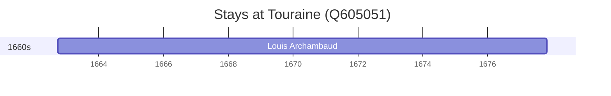

# Touraine (Q605051)

*historical province of France*

Wikidata: [Q605051](https://www.wikidata.org/wiki/Q605051)

1 occurrence(s) across 1 transcribed value(s), 1 person(s).

**Transcribed variants:**

- `Touraine` (1×, 1662–1662)

| Date | Variant | Person | Type | Entity id | Real entity |
|------|---------|--------|------|-----------|-------------|
| 1662-09-27 | Touraine | Louis Archambaud | nascimento | [deh-louis-archambaud](deh-louis-archambaud) | — |

