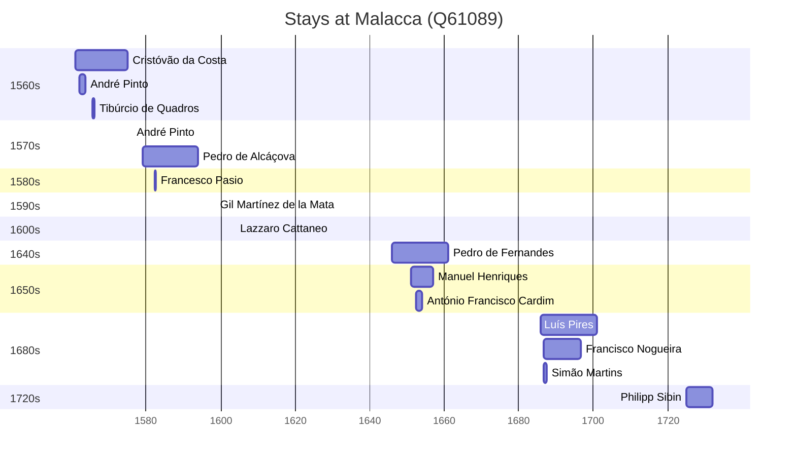

# Malacca (Q61089)

*state capital of Malacca, Malaysia*

Wikidata: [Q61089](https://www.wikidata.org/wiki/Q61089)

29 occurrence(s) across 2 transcribed value(s), 25 person(s).

**Transcribed variants:**

- `Malaca` (28×, 1548–1728)
- `[Perto de Malaca]` (1×, 1652–1652)

| Date | Variant | Person | Type | Entity id | Real entity |
|------|---------|--------|------|-----------|-------------|
| — | Malaca | August von Hallerstein | estadia | [deh-august-von-hallerstein](deh-august-von-hallerstein) | — |
| — | Malaca | Baltasar Gago | estadia | [deh-baltasar-gago](deh-baltasar-gago) | — |
| — | Malaca | Claude de Bèze | estadia | [deh-claude-de-beze](deh-claude-de-beze) | — |
| — | Malaca | Diogo Pinto | estadia | [deh-diogo-pinto](deh-diogo-pinto) | — |
| — | Malaca | Francisco Xavier | estadia | [deh-pedro-de-alcacova-ref1](deh-pedro-de-alcacova-ref1) | — |
| 1548 | Malaca | Francisco Pérez | estadia | [deh-francisco-perez](deh-francisco-perez) | [rp892854](rp892854) |
| 1554-04-16 | Malaca | Belchior Nunes Barreto | partida-x | [deh-belchior-nunes-barreto](deh-belchior-nunes-barreto) | [rp606650](rp606650) |
| 1561 | Malaca | Cristóvão da Costa | estadia | [deh-cristovao-da-costa](deh-cristovao-da-costa) | — |
| 1562 | Malaca | André Pinto | estadia | [deh-andre-pinto](deh-andre-pinto) | — |
| 1563-06-13 | Malaca | Manuel Teixeira | partida | [deh-manuel-teixeira](deh-manuel-teixeira) | [rp212210](rp212210) |
| 1563-06-13 | Malaca | Francisco Pérez | partida | [deh-manuel-teixeira-ref2](deh-manuel-teixeira-ref2) | — |
| 1563-06-13 | Malaca | André Pinto | partida | [deh-manuel-teixeira-ref3](deh-manuel-teixeira-ref3) | — |
| 1565-09-17 | Malaca | Tibúrcio de Quadros | estadia | [deh-tiburcio-de-quadros](deh-tiburcio-de-quadros) | — |
| 1572 | Malaca | Cristóvão da Costa | estadia | [deh-cristovao-da-costa](deh-cristovao-da-costa) | — |
| 1576 | Malaca | André Pinto | jesuita-ordenacao-padre | [deh-andre-pinto](deh-andre-pinto) | — |
| 1582-06 | Malaca | Francesco Pasio | estadia | [deh-francesco-pasio](deh-francesco-pasio) | — |
| 1593-02 | Malaca | Theodor Mantels | morte | [deh-theodor-mantels](deh-theodor-mantels) | — |
| 1598-06-30 | Malaca | Gil Martínez de la Mata | estadia | [deh-gil-martinez-de-la-mata](deh-gil-martinez-de-la-mata) | — |
| 1604 | Malaca | Lazzaro Cattaneo | estadia | [deh-lazzaro-cattaneo](deh-lazzaro-cattaneo) | — |
| 1646 | Malaca | Pedro de Fernandes | estadia | [deh-pedro-de-francisco-ref1](deh-pedro-de-francisco-ref1) | — |
| 1651 | Malaca | Manuel Henriques | estadia | [deh-manuel-henriques](deh-manuel-henriques) | — |
| 1652-06-15 | [Perto de Malaca] | António Francisco Cardim | estadia | [deh-antonio-francisco-cardim](deh-antonio-francisco-cardim) | [rp536947](rp536947) |
| 1655 | Malaca | Manuel Henriques | estadia | [deh-manuel-henriques](deh-manuel-henriques) | — |
| 1686 | Malaca | Luís Pires | estadia | [deh-luis-pires](deh-luis-pires) | — |
| 1686-08 | Malaca | Francisco Nogueira | estadia | [deh-francisco-nogueira](deh-francisco-nogueira) | — |
| 1686-08 | Malaca | Simão Martins | chegada | [deh-simao-martins](deh-simao-martins) | — |
| 1725 | Malaca | Philipp Sibin | estadia | [deh-philipp-sibin](deh-philipp-sibin) | — |
| 1728 | Malaca | Philipp Sibin | estadia | [deh-philipp-sibin](deh-philipp-sibin) | — |
| >1548-05-02:<1552 | Malaca | Pedro de Alcáçova | estadia | [deh-pedro-de-alcacova](deh-pedro-de-alcacova) | — |

### Co-presence

These persons were plausibly at this place during overlapping periods (interval estimation from stay dates; rough — see method note below).

| Period | Persons |
|--------|---------|
| 1560s | [André Pinto](deh-andre-pinto), [Cristóvão da Costa](deh-cristovao-da-costa), [Tibúrcio de Quadros](deh-tiburcio-de-quadros) |
| 1650s | [António Francisco Cardim](rp536947), [Manuel Henriques](deh-manuel-henriques) |
| 1680s | [Francisco Nogueira](deh-francisco-nogueira), [Simão Martins](deh-simao-martins) |

*4 overlapping pair(s) involving 7 person(s). Method: interval start = stay event date; end = next embarque/partida/different-place event, or death, or +15yr cap.*

