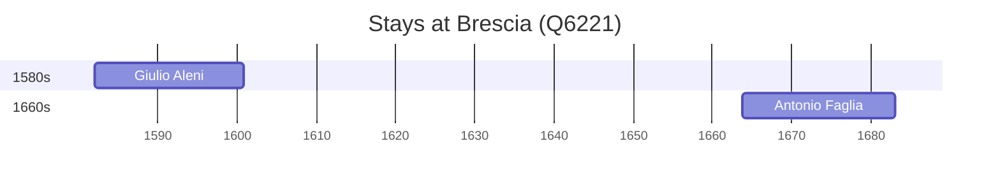

# Brescia (Q6221)

*Italian city in Lombardy*

Wikidata: [Q6221](https://www.wikidata.org/wiki/Q6221)

2 occurrence(s) across 1 transcribed value(s), 2 person(s).

**Transcribed variants:**

- `Brescia` (2×, 1582–1663)

| Date | Variant | Person | Type | Entity id | Real entity |
|------|---------|--------|------|-----------|-------------|
| 1582 | Brescia | Giulio Aleni | nascimento | [deh-giulio-aleni](deh-giulio-aleni) | — |
| 1663-11-03 | Brescia | Antonio Faglia | nascimento | [deh-antonio-faglia](deh-antonio-faglia) | — |

