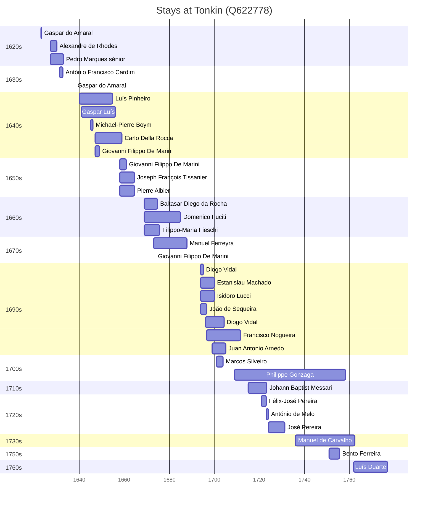

# Tonkin (Q622778)

*northern part of Vietnam, to the west of the Gulf of Tonkin*

Wikidata: [Q622778](https://www.wikidata.org/wiki/Q622778)

62 occurrence(s) across 4 transcribed value(s), 35 person(s).

**Transcribed variants:**

- `Tonquim` (58×, 1623–1762)
- `Tonquim (corte de Quecho)` (1×, 1631–1631)
- `Tonquim («in sacello S. J.»)` (1×, 1638–1638)
- `Tonquim (prisão)` (2×, 1696–1723)

| Date | Variant | Person | Type | Entity id | Real entity |
|------|---------|--------|------|-----------|-------------|
| — | Tonquim | António de Melo | estadia | [deh-antonio-de-melo](deh-antonio-de-melo) | — |
| — | Tonquim | Francisco Nogueira | partida | [deh-francisco-nogueira](deh-francisco-nogueira) | — |
| — | Tonquim | João Cabral | estadia | [deh-joao-cabral](deh-joao-cabral) | — |
| — | Tonquim | Manuel Ferreyra | estadia | [deh-manuel-ferreira-ref1](deh-manuel-ferreira-ref1) | — |
| — | Tonquim | Michael-Pierre Boym | estadia | [deh-michael-pierre-boym](deh-michael-pierre-boym) | — |
| — | Tonquim | Philipp Sibin | chegada | [deh-philipp-sibin](deh-philipp-sibin) | — |
| — | Tonquim | Philippe Gonzaga | nacionalidade | [deh-philippe-gonzaga](deh-philippe-gonzaga) | — |
| 1623 | Tonquim | Gaspar do Amaral | estadia | [deh-gaspar-do-amaral](deh-gaspar-do-amaral) | — |
| 1627-03-19 | Tonquim | Alexandre de Rhodes | estadia | [deh-alexandre-de-rhodes](deh-alexandre-de-rhodes) | — |
| 1627-03-19 | Tonquim | Pedro Marques, sénior | estadia | [deh-pedro-marques-senior](deh-pedro-marques-senior) | — |
| 1630 | Tonquim | Alexandre de Rhodes | estadia | [deh-alexandre-de-rhodes](deh-alexandre-de-rhodes) | — |
| 1631-03-15 | Tonquim (corte de Quecho) | António Francisco Cardim | estadia | [deh-antonio-francisco-cardim](deh-antonio-francisco-cardim) | [rp536947](rp536947) |
| 1638-01-06 | Tonquim («in sacello S. J.») | Gaspar do Amaral | jesuita-votos-local | [deh-gaspar-do-amaral](deh-gaspar-do-amaral) | — |
| 1640 | Tonquim | Luís Pinheiro | chegada | [deh-luis-pinheiro](deh-luis-pinheiro) | — |
| 1641 | Tonquim | Gaspar Luís | estadia | [deh-gaspar-luis](deh-gaspar-luis) | — |
| 1645 | Tonquim | Michael-Pierre Boym | estadia | [deh-michael-pierre-boym](deh-michael-pierre-boym) | — |
| 1647 | Tonquim | Carlo Della Rocca | estadia | [deh-carlo-della-rocca](deh-carlo-della-rocca) | — |
| 1647 | Tonquim | Giovanni Filippo De Marini | estadia | [deh-giovanni-filippo-de-marini](deh-giovanni-filippo-de-marini) | — |
| 1647-11-01 | Tonquim | João Nunes | partida | [deh-joao-nunes](deh-joao-nunes) | — |
| 1658 | Tonquim | Carlo Della Rocca | estadia | [deh-carlo-della-rocca](deh-carlo-della-rocca) | — |
| 1658 | Tonquim | Giovanni Filippo De Marini | estadia | [deh-giovanni-filippo-de-marini](deh-giovanni-filippo-de-marini) | — |
| 1658 | Tonquim | Joseph François Tissanier | estadia | [deh-joseph-francois-tissanier](deh-joseph-francois-tissanier) | — |
| 1658 | Tonquim | Pierre Albier | estadia | [deh-pierre-albier](deh-pierre-albier) | — |
| 1663 | Tonquim | Joseph François Tissanier | estadia | [deh-joseph-francois-tissanier](deh-joseph-francois-tissanier) | — |
| 1663 | Tonquim | Pierre Albier | estadia | [deh-pierre-albier](deh-pierre-albier) | — |
| 1669 | Tonquim | Baltasar Diego da Rocha | estadia | [deh-baltasar-diego-da-rocha](deh-baltasar-diego-da-rocha) | — |
| 1669 | Tonquim | Domenico Fuciti | estadia | [deh-domenico-fuciti](deh-domenico-fuciti) | — |
| 1669 | Tonquim | Filippo-Maria Fieschi | estadia | [deh-filippo-maria-fieschi](deh-filippo-maria-fieschi) | — |
| 1673 | Tonquim | Manuel Ferreyra | estadia | [deh-manuel-ferreira-ref1](deh-manuel-ferreira-ref1) | — |
| 1673-09 | Tonquim | Giovanni Filippo De Marini | estadia | [deh-giovanni-filippo-de-marini](deh-giovanni-filippo-de-marini) | — |
| 1673-09-21 | Tonquim | Francisco Pimentel | partida | [deh-francisco-pimentel](deh-francisco-pimentel) | — |
| 1675-09-05 | Tonquim | Francisco Pimentel | morte | [deh-francisco-pimentel](deh-francisco-pimentel) | — |
| 1679 | Tonquim | Domenico Fuciti | estadia | [deh-domenico-fuciti](deh-domenico-fuciti) | — |
| 1681 | Tonquim | Manuel Ferreyra | estadia | [deh-manuel-ferreira-ref1](deh-manuel-ferreira-ref1) | — |
| 1694 | Tonquim | Diogo Vidal | estadia | [deh-diogo-vidal](deh-diogo-vidal) | — |
| 1694 | Tonquim | Isidoro Lucci | estadia | [deh-isidoro-lucci](deh-isidoro-lucci) | — |
| 1694 | Tonquim | João de Sequeira | estadia | [deh-joao-de-sequeira](deh-joao-de-sequeira) | — |
| 1694 | Tonquim | Manuel Ferreyra | partida | [deh-manuel-ferreira-ref1](deh-manuel-ferreira-ref1) | — |
| 1694 | Tonquim | Estanislau Machado | estadia | [deh-estanislau-machado](deh-estanislau-machado) | — |
| 1696 | Tonquim | Diogo Vidal | estadia | [deh-diogo-vidal](deh-diogo-vidal) | — |
| 1696-08-21 | Tonquim | João de Sequeira | morte | [deh-joao-de-sequeira](deh-joao-de-sequeira) | — |
| 1696-09-05 | Tonquim | Francisco Nogueira | estadia | [deh-francisco-nogueira](deh-francisco-nogueira) | — |
| 1696-09-05 | Tonquim (prisão) | Francisco Nogueira | morte | [deh-francisco-nogueira](deh-francisco-nogueira) | — |
| 1697 | Tonquim | Diogo Vidal | estadia | [deh-diogo-vidal](deh-diogo-vidal) | — |
| 1699 | Tonquim | Juan Antonio Arnedo | estadia | [deh-juan-antonio-arnedo](deh-juan-antonio-arnedo) | [rp780907](rp780907) |
| 1701 | Tonquim | Marcos Silveiro | chegada | [deh-marcos-silveiro](deh-marcos-silveiro) | — |
| 1709 | Tonquim | Philippe Gonzaga | nascimento | [deh-philippe-gonzaga](deh-philippe-gonzaga) | — |
| 1715 | Tonquim | Johann Baptist Messari | estadia | [deh-johann-baptist-messari](deh-johann-baptist-messari) | — |
| 1719-11-04 | Tonquim | Isidoro Lucci | morte | [deh-isidoro-lucci](deh-isidoro-lucci) | — |
| 1721 | Tonquim | Félix-José Pereira | estadia | [deh-felix-jose-pereira](deh-felix-jose-pereira) | — |
| 1723 | Tonquim | António de Melo | estadia | [deh-antonio-de-melo](deh-antonio-de-melo) | — |
| 1723-03-07 | Tonquim | Félix-José Pereira | morte | [deh-felix-jose-pereira](deh-felix-jose-pereira) | — |
| 1723-06 | Tonquim (prisão) | Johann Baptist Messari | morte | [deh-johann-baptist-messari](deh-johann-baptist-messari) | — |
| 1724 | Tonquim | José Pereira | estadia | [deh-jose-pereira](deh-jose-pereira) | — |
| 1729-07-20 | Tonquim | Estanislau Machado | morte | [deh-estanislau-machado](deh-estanislau-machado) | — |
| 1736 | Tonquim | Manuel de Carvalho | estadia | [deh-manuel-de-carvalho](deh-manuel-de-carvalho) | — |
| 1750 | Tonquim | Manuel de Carvalho | estadia | [deh-manuel-de-carvalho](deh-manuel-de-carvalho) | — |
| 1751 | Tonquim | Bento Ferreira | estadia | [deh-bento-ferreira](deh-bento-ferreira) | — |
| 1751-03-06 | Tonquim | Giacomo Filippo Simonelli | partida | [deh-giacomo-filippo-simonelli](deh-giacomo-filippo-simonelli) | — |
| 1754-08-15 | Tonquim | Bento Ferreira | jesuita-votos-local | [deh-bento-ferreira](deh-bento-ferreira) | — |
| 1755-09-13 | Tonquim | Bento Ferreira | morte | [deh-bento-ferreira](deh-bento-ferreira) | — |
| 1762 | Tonquim | Luís Duarte | estadia | [deh-luis-duarte](deh-luis-duarte) | — |

### Co-presence

These persons were plausibly at this place during overlapping periods (interval estimation from stay dates; rough — see method note below).

| Period | Persons |
|--------|---------|
| 1620s | [Alexandre de Rhodes](deh-alexandre-de-rhodes), [Pedro Marques, sénior](deh-pedro-marques-senior) |
| 1630s | [António Francisco Cardim](rp536947), [Pedro Marques, sénior](deh-pedro-marques-senior) |
| 1640s | [Carlo Della Rocca](deh-carlo-della-rocca), [Giovanni Filippo De Marini](deh-giovanni-filippo-de-marini), [Luís Pinheiro](deh-luis-pinheiro), [Michael-Pierre Boym](deh-michael-pierre-boym) |
| 1650s | [Carlo Della Rocca](deh-carlo-della-rocca), [Giovanni Filippo De Marini](deh-giovanni-filippo-de-marini), [Joseph François Tissanier](deh-joseph-francois-tissanier), [Pierre Albier](deh-pierre-albier) |
| 1660s | [Baltasar Diego da Rocha](deh-baltasar-diego-da-rocha), [Domenico Fuciti](deh-domenico-fuciti), [Filippo-Maria Fieschi](deh-filippo-maria-fieschi) |
| 1670s | [Baltasar Diego da Rocha](deh-baltasar-diego-da-rocha), [Domenico Fuciti](deh-domenico-fuciti), [Filippo-Maria Fieschi](deh-filippo-maria-fieschi), [Giovanni Filippo De Marini](deh-giovanni-filippo-de-marini), [Manuel Ferreyra](deh-manuel-ferreira-ref1) |
| 1690s | [Diogo Vidal](deh-diogo-vidal), [Estanislau Machado](deh-estanislau-machado), [Isidoro Lucci](deh-isidoro-lucci), [João de Sequeira](deh-joao-de-sequeira), [Juan Antonio Arnedo](rp780907) |
| 1700s | [Diogo Vidal](deh-diogo-vidal), [Juan Antonio Arnedo](rp780907), [Marcos Silveiro](deh-marcos-silveiro) |
| 1710s | [Johann Baptist Messari](deh-johann-baptist-messari), [Philippe Gonzaga](deh-philippe-gonzaga) |
| 1720s | [António de Melo](deh-antonio-de-melo), [Félix-José Pereira](deh-felix-jose-pereira), [Johann Baptist Messari](deh-johann-baptist-messari), [José Pereira](deh-jose-pereira), [Philippe Gonzaga](deh-philippe-gonzaga) |
| 1730s | [Manuel de Carvalho](deh-manuel-de-carvalho), [Philippe Gonzaga](deh-philippe-gonzaga) |
| 1750s | [Bento Ferreira](deh-bento-ferreira), [Manuel de Carvalho](deh-manuel-de-carvalho), [Philippe Gonzaga](deh-philippe-gonzaga) |

*46 overlapping pair(s) involving 26 person(s). Method: interval start = stay event date; end = next embarque/partida/different-place event, or death, or +15yr cap.*

