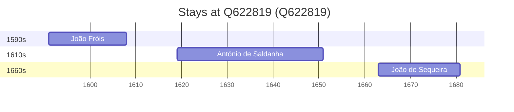

# Q622819

*(fetch error: HTTP Error 429: Too Many Requests)*

Wikidata: [Q622819](https://www.wikidata.org/wiki/Q622819)

3 occurrence(s) across 1 transcribed value(s), 3 person(s).

**Transcribed variants:**

- `Portalegre` (3×, 1591–1663)

| Date | Variant | Person | Type | Entity id | Real entity |
|------|---------|--------|------|-----------|-------------|
| 1591 | Portalegre | João Fróis | nascimento | [deh-joao-frois](deh-joao-frois) | — |
| 1619 | Portalegre | António de Saldanha | nascimento | [deh-antonio-de-saldanha](deh-antonio-de-saldanha) | — |
| 1663 | Portalegre | João de Sequeira | nascimento | [deh-joao-de-sequeira](deh-joao-de-sequeira) | — |

