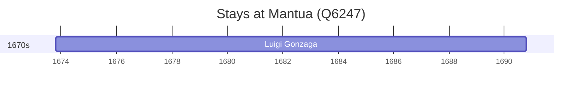

# Mantua (Q6247)

*Italian comune and city*

Wikidata: [Q6247](https://www.wikidata.org/wiki/Q6247)

1 occurrence(s) across 1 transcribed value(s), 1 person(s).

**Transcribed variants:**

- `Mântua` (1×, 1673–1673)

| Date | Variant | Person | Type | Entity id | Real entity |
|------|---------|--------|------|-----------|-------------|
| 1673-10-21 | Mântua | Luigi Gonzaga | nascimento | [deh-luigi-gonzaga](deh-luigi-gonzaga) | — |

