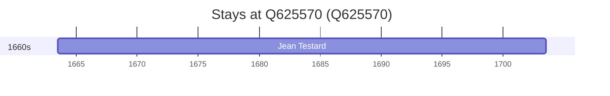

# Q625570

*(fetch error: HTTP Error 429: Too Many Requests)*

Wikidata: [Q625570](https://www.wikidata.org/wiki/Q625570)

1 occurrence(s) across 1 transcribed value(s), 1 person(s).

**Transcribed variants:**

- `Langeac` (1×, 1663–1663)

| Date | Variant | Person | Type | Entity id | Real entity |
|------|---------|--------|------|-----------|-------------|
| 1663-06-24 | Langeac | Jean Testard | nascimento | [deh-jean-testard](deh-jean-testard) | — |

