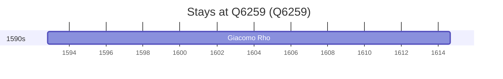

# Q6259

*(fetch error: HTTP Error 429: Too Many Requests)*

Wikidata: [Q6259](https://www.wikidata.org/wiki/Q6259)

1 occurrence(s) across 1 transcribed value(s), 1 person(s).

**Transcribed variants:**

- `Pavia` (1×, 1592–1592)

| Date | Variant | Person | Type | Entity id | Real entity |
|------|---------|--------|------|-----------|-------------|
| 1592-10-29 | Pavia | Giacomo Rho | nascimento | [deh-giacomo-rho](deh-giacomo-rho) | — |

