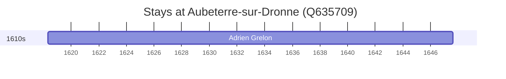

# Aubeterre-sur-Dronne (Q635709)

*commune in Charente, France*

Wikidata: [Q635709](https://www.wikidata.org/wiki/Q635709)

1 occurrence(s) across 1 transcribed value(s), 1 person(s).

**Transcribed variants:**

- `Aubeterre-sur-Dronne` (1×, 1618–1618)

| Date | Variant | Person | Type | Entity id | Real entity |
|------|---------|--------|------|-----------|-------------|
| 1618-04-29 | Aubeterre-sur-Dronne | Adrien Grelon | nascimento | [deh-adrien-grelon](deh-adrien-grelon) | — |

