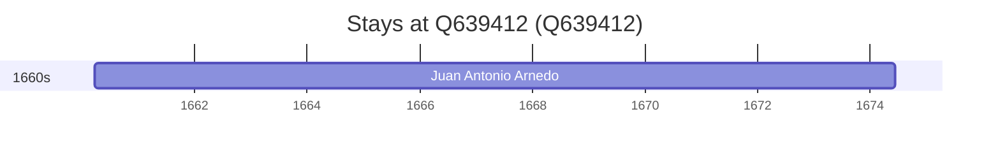

# Q639412

*(fetch error: HTTP Error 429: Too Many Requests)*

Wikidata: [Q639412](https://www.wikidata.org/wiki/Q639412)

1 occurrence(s) across 1 transcribed value(s), 1 person(s).

**Transcribed variants:**

- `Tarazona` (1×, 1660–1660)

| Date | Variant | Person | Type | Entity id | Real entity |
|------|---------|--------|------|-----------|-------------|
| 1660-03-21 | Tarazona | Juan Antonio Arnedo | nascimento | [deh-juan-antonio-arnedo](deh-juan-antonio-arnedo) | [rp780907](rp780907) |

