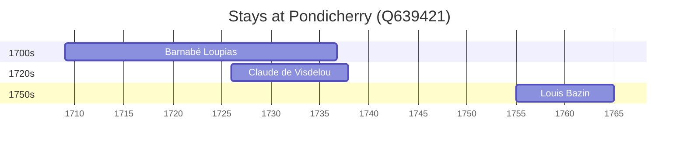

# Pondicherry (Q639421)

*city in the Union Territory of Puducherry, India*

Wikidata: [Q639421](https://www.wikidata.org/wiki/Q639421)

9 occurrence(s) across 2 transcribed value(s), 5 person(s).

**Transcribed variants:**

- `Pondichéry` (8×, 1709–1737)
- `Pondicherry` (1×, 1755–1755)

| Date | Variant | Person | Type | Entity id | Real entity |
|------|---------|--------|------|-----------|-------------|
| — | Pondichéry | Bernard Rodes | estadia | [deh-bernard-rodes](deh-bernard-rodes) | — |
| 1709 | Pondichéry | Barnabé Loupias | estadia | [deh-barnabe-loupias](deh-barnabe-loupias) | — |
| 1709-06-24 | Pondichéry | Claude de Visdelou | partida | [deh-claude-de-visdelou](deh-claude-de-visdelou) | — |
| 1709-09-08 | Pondichéry | Barnabé Loupias | jesuita-votos-local | [deh-barnabe-loupias](deh-barnabe-loupias) | — |
| 1716-01-12 | Pondichéry | Alexandre Cazalez | partida | [deh-alexandre-cazalez](deh-alexandre-cazalez) | — |
| 1719-11-19 | Pondichéry | Alexandre Cazalez | morte | [deh-alexandre-cazalez](deh-alexandre-cazalez) | — |
| 1726 | Pondichéry | Claude de Visdelou | estadia | [deh-claude-de-visdelou](deh-claude-de-visdelou) | — |
| 1737-11-11 | Pondichéry | Claude de Visdelou | morte | [deh-claude-de-visdelou](deh-claude-de-visdelou) | — |
| 1755 | Pondicherry | Louis Bazin | estadia | [deh-louis-bazin](deh-louis-bazin) | — |

### Co-presence

These persons were plausibly at this place during overlapping periods (interval estimation from stay dates; rough — see method note below).

| Period | Persons |
|--------|---------|
| 1720s | [Barnabé Loupias](deh-barnabe-loupias), [Claude de Visdelou](deh-claude-de-visdelou) |

*1 overlapping pair(s) involving 2 person(s). Method: interval start = stay event date; end = next embarque/partida/different-place event, or death, or +15yr cap.*

