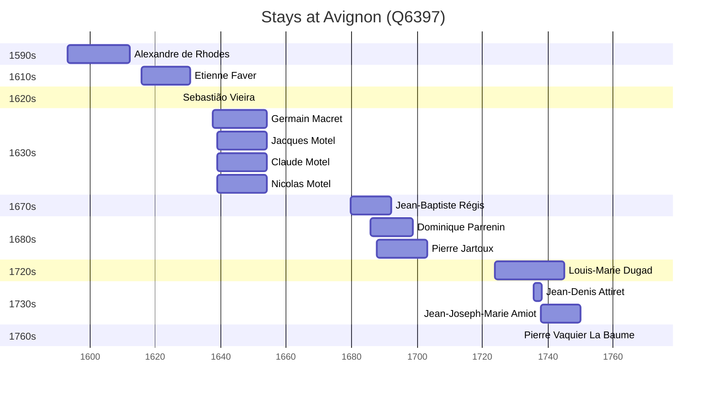

# Avignon (Q6397)

*commune in Vaucluse, France*

Wikidata: [Q6397](https://www.wikidata.org/wiki/Q6397)

17 occurrence(s) across 2 transcribed value(s), 14 person(s).

**Transcribed variants:**

- `Avignon` (16×, 1593–1737)
- `Avignon (igreja do noviciado)` (1×, 1767–1767)

| Date | Variant | Person | Type | Entity id | Real entity |
|------|---------|--------|------|-----------|-------------|
| — | Avignon | Etienne Faver | estadia | [deh-etienne-faber](deh-etienne-faber) | — |
| 1593-03-15 | Avignon | Alexandre de Rhodes | nascimento | [deh-alexandre-de-rhodes](deh-alexandre-de-rhodes) | — |
| 1615-09-26 | Avignon | Etienne Faver | jesuita-entrada | [deh-etienne-faber](deh-etienne-faber) | — |
| 1626-12-25 | Avignon | Sebastião Vieira | estadia | [deh-sebastiao-vieira](deh-sebastiao-vieira) | — |
| 1627 | Avignon | Etienne Faver | jesuita-ordenacao-padre | [deh-etienne-faber](deh-etienne-faber) | — |
| 1637-09-03 | Avignon | Germain Macret | jesuita-entrada | [deh-germain-macret](deh-germain-macret) | — |
| 1638-11-08 | Avignon | Jacques Motel | jesuita-entrada | [deh-jacques-motel](deh-jacques-motel) | — |
| 1638-11-11 | Avignon | Claude Motel | jesuita-entrada | [deh-claude-motel](deh-claude-motel) | — |
| 1638-11-11 | Avignon | Nicolas Motel | jesuita-entrada | [deh-nicolas-motel](deh-nicolas-motel) | — |
| 1679-09-13 | Avignon | Jean-Baptiste Régis | jesuita-entrada | [deh-jean-baptiste-regis](deh-jean-baptiste-regis) | — |
| 1685-09-01 | Avignon | Dominique Parrenin | jesuita-entrada | [deh-dominique-parrenin](deh-dominique-parrenin) | — |
| 1687-09-29 | Avignon | Pierre Jartoux | jesuita-entrada | [deh-pierre-jartoux](deh-pierre-jartoux) | — |
| 1695 | Avignon | Dominique Parrenin | jesuita-ordenacao-padre | [deh-dominique-parrenin](deh-dominique-parrenin) | — |
| 1723-10-09 | Avignon | Louis-Marie Dugad | jesuita-entrada | [deh-louis-marie-dugad](deh-louis-marie-dugad) | — |
| 1735-07-31 | Avignon | Jean-Denis Attiret | jesuita-entrada | [deh-jean-denis-attiret](deh-jean-denis-attiret) | — |
| 1737-09-27 | Avignon | Jean-Joseph-Marie Amiot | jesuita-entrada | [deh-jean-joseph-marie-amiot](deh-jean-joseph-marie-amiot) | — |
| 1767-11-13 | Avignon (igreja do noviciado) | Pierre Vaquier La Baume | jesuita-votos-local | [deh-pierre-vaquier-la-baume](deh-pierre-vaquier-la-baume) | — |

### Co-presence

These persons were plausibly at this place during overlapping periods (interval estimation from stay dates; rough — see method note below).

| Period | Persons |
|--------|---------|
| 1620s | [Etienne Faver](deh-etienne-faber), [Sebastião Vieira](deh-sebastiao-vieira) |
| 1630s | [Claude Motel](deh-claude-motel), [Germain Macret](deh-germain-macret), [Jacques Motel](deh-jacques-motel), [Nicolas Motel](deh-nicolas-motel) |
| 1680s | [Dominique Parrenin](deh-dominique-parrenin), [Jean-Baptiste Régis](deh-jean-baptiste-regis), [Pierre Jartoux](deh-pierre-jartoux) |
| 1730s | [Jean-Denis Attiret](deh-jean-denis-attiret), [Jean-Joseph-Marie Amiot](deh-jean-joseph-marie-amiot), [Louis-Marie Dugad](deh-louis-marie-dugad) |

*13 overlapping pair(s) involving 12 person(s). Method: interval start = stay event date; end = next embarque/partida/different-place event, or death, or +15yr cap.*

