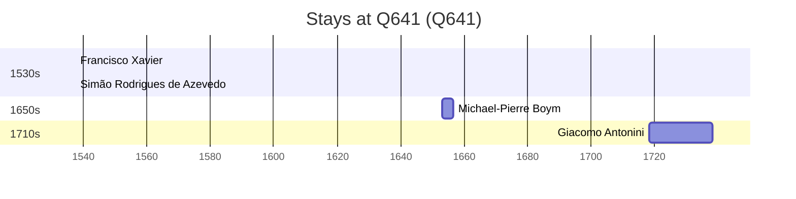

# Q641

*(fetch error: HTTP Error 429: Too Many Requests)*

Wikidata: [Q641](https://www.wikidata.org/wiki/Q641)

4 occurrence(s) across 1 transcribed value(s), 4 person(s).

**Transcribed variants:**

- `Veneza` (4×, 1537–1718)

| Date | Variant | Person | Type | Entity id | Real entity |
|------|---------|--------|------|-----------|-------------|
| 1537-06-24 | Veneza | Francisco Xavier | jesuita-ordenacao-padre | [deh-francisco-xavier](deh-francisco-xavier) | — |
| 1537-06-24 | Veneza | Simão Rodrigues de Azevedo | jesuita-ordenacao-padre | [deh-simao-rodrigues-de-azevedo](deh-simao-rodrigues-de-azevedo) | — |
| 1652-12-16 | Veneza | Michael-Pierre Boym | estadia | [deh-michael-pierre-boym](deh-michael-pierre-boym) | — |
| 1718-04-24 | Veneza | Giacomo Antonini | jesuita-entrada | [deh-giacomo-antonini](deh-giacomo-antonini) | — |

