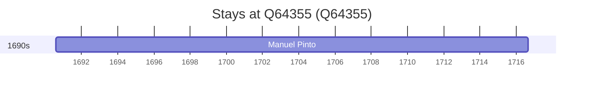

# Q64355

*(fetch error: HTTP Error 429: Too Many Requests)*

Wikidata: [Q64355](https://www.wikidata.org/wiki/Q64355)

1 occurrence(s) across 1 transcribed value(s), 1 person(s).

**Transcribed variants:**

- `Nespereira, diocese de Viseu` (1×, 1690–1690)

| Date | Variant | Person | Type | Entity id | Real entity |
|------|---------|--------|------|-----------|-------------|
| 1690-08-04 | Nespereira, diocese de Viseu | Manuel Pinto | nascimento | [deh-manuel-pinto-iii](deh-manuel-pinto-iii) | — |

