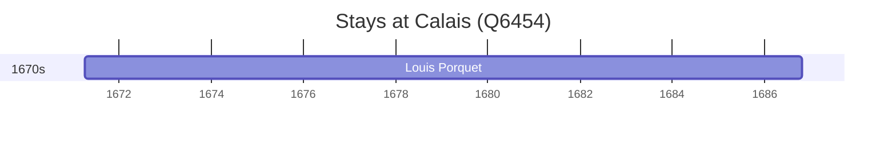

# Calais (Q6454)

*commune in Pas-de-Calais, France*

Wikidata: [Q6454](https://www.wikidata.org/wiki/Q6454)

1 occurrence(s) across 1 transcribed value(s), 1 person(s).

**Transcribed variants:**

- `Calais` (1×, 1671–1671)

| Date | Variant | Person | Type | Entity id | Real entity |
|------|---------|--------|------|-----------|-------------|
| 1671-04-07 | Calais | Louis Porquet | nascimento | [deh-louis-porquet](deh-louis-porquet) | [rp585015](rp585015) |

