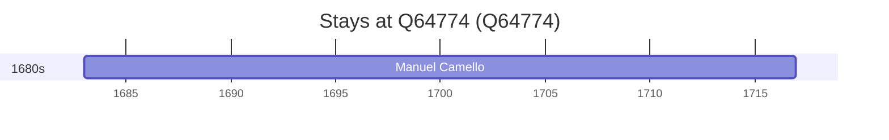

# Q64774

*(fetch error: HTTP Error 429: Too Many Requests)*

Wikidata: [Q64774](https://www.wikidata.org/wiki/Q64774)

1 occurrence(s) across 1 transcribed value(s), 1 person(s).

**Transcribed variants:**

- `Penajóia, diocese de Lamego` (1×, 1683–1683)

| Date | Variant | Person | Type | Entity id | Real entity |
|------|---------|--------|------|-----------|-------------|
| 1683 | Penajóia, diocese de Lamego | Manuel Camello | nascimento | [deh-manuel-camello](deh-manuel-camello) | — |

