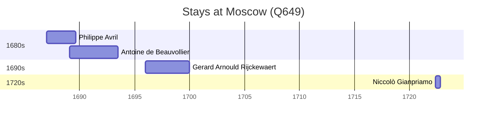

# Moscow (Q649)

*capital and most populous city of Russia*

Wikidata: [Q649](https://www.wikidata.org/wiki/Q649)

7 occurrence(s) across 1 transcribed value(s), 5 person(s).

**Transcribed variants:**

- `Moscovo` (7×, 1686–1722)

| Date | Variant | Person | Type | Entity id | Real entity |
|------|---------|--------|------|-----------|-------------|
| 1686 | Moscovo | Claudio Filippo Grimaldi | partida | [deh-claudio-filippo-grimaldi](deh-claudio-filippo-grimaldi) | — |
| 1687-01 | Moscovo | Philippe Avril | estadia | [deh-philippe-avril](deh-philippe-avril) | [rp636254](rp636254) |
| 1689-02 | Moscovo | Antoine de Beauvollier | estadia | [deh-antoine-de-beauvollier](deh-antoine-de-beauvollier) | — |
| 1689-02-02 | Moscovo | Philippe Avril | jesuita-votos-local | [deh-philippe-avril](deh-philippe-avril) | [rp636254](rp636254) |
| 1696 | Moscovo | Gerard Arnould Rijckewaert | estadia | [deh-gerard-arnould-rijckewaert](deh-gerard-arnould-rijckewaert) | — |
| 1722-05-06 | Moscovo | Niccolò Gianpriamo | estadia | [deh-niccolo-gianpriamo](deh-niccolo-gianpriamo) | — |
| 1722-06-09 | Moscovo | Niccolò Gianpriamo | estadia | [deh-niccolo-gianpriamo](deh-niccolo-gianpriamo) | — |

### Co-presence

These persons were plausibly at this place during overlapping periods (interval estimation from stay dates; rough — see method note below).

| Period | Persons |
|--------|---------|
| 1680s | [Antoine de Beauvollier](deh-antoine-de-beauvollier), [Philippe Avril](rp636254) |

*1 overlapping pair(s) involving 2 person(s). Method: interval start = stay event date; end = next embarque/partida/different-place event, or death, or +15yr cap.*

