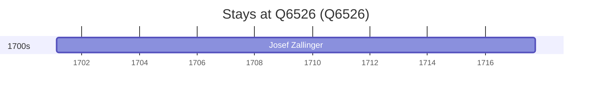

# Q6526

*(fetch error: HTTP Error 429: Too Many Requests)*

Wikidata: [Q6526](https://www.wikidata.org/wiki/Q6526)

1 occurrence(s) across 1 transcribed value(s), 1 person(s).

**Transcribed variants:**

- `Bolzano, diocese de Trento` (1×, 1701–1701)

| Date | Variant | Person | Type | Entity id | Real entity |
|------|---------|--------|------|-----------|-------------|
| 1701-02-16 | Bolzano, diocese de Trento | Josef Zallinger | nascimento | [deh-josef-zallinger](deh-josef-zallinger) | — |

