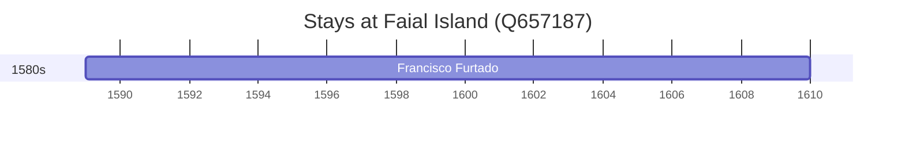

# Faial Island (Q657187)

*Portuguese island of the Central Group of the Azores*

Wikidata: [Q657187](https://www.wikidata.org/wiki/Q657187)

1 occurrence(s) across 1 transcribed value(s), 1 person(s).

**Transcribed variants:**

- `Ilha do Faial, Açores` (1×, 1589–1589)

| Date | Variant | Person | Type | Entity id | Real entity |
|------|---------|--------|------|-----------|-------------|
| 1589 | Ilha do Faial, Açores | Francisco Furtado | nascimento | [deh-francisco-furtado](deh-francisco-furtado) | — |

