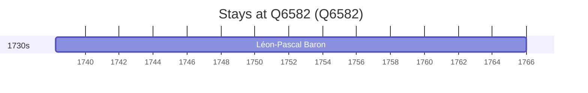

# Q6582

*(fetch error: HTTP Error 429: Too Many Requests)*

Wikidata: [Q6582](https://www.wikidata.org/wiki/Q6582)

1 occurrence(s) across 1 transcribed value(s), 1 person(s).

**Transcribed variants:**

- `Carcassone` (1×, 1738–1738)

| Date | Variant | Person | Type | Entity id | Real entity |
|------|---------|--------|------|-----------|-------------|
| 1738-04-06 | Carcassone | Léon-Pascal Baron | nascimento | [deh-leon-pascal-baron](deh-leon-pascal-baron) | — |

