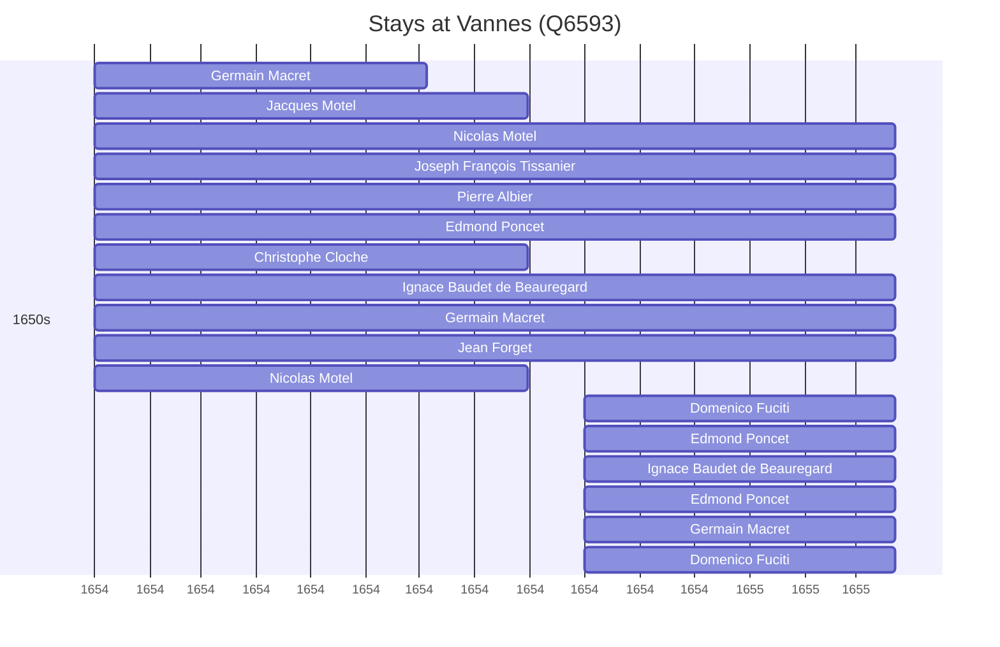

# Vannes (Q6593)

*commune in Morbihan, France*

Wikidata: [Q6593](https://www.wikidata.org/wiki/Q6593)

17 occurrence(s) across 1 transcribed value(s), 17 person(s).

**Transcribed variants:**

- `Vannes` (17×, 1654–1654)

| Date | Variant | Person | Type | Entity id | Real entity |
|------|---------|--------|------|-----------|-------------|
| 1654 | Vannes | Germain Macret | estadia | [deh-germain-macret](deh-germain-macret) | — |
| 1654 | Vannes | Jacques Motel | estadia | [deh-jacques-motel](deh-jacques-motel) | — |
| 1654 | Vannes | Nicolas Motel | estadia | [deh-jacques-motel-irmao-2](deh-jacques-motel-irmao-2) | — |
| 1654 | Vannes | Joseph François Tissanier | estadia | [deh-jacques-motel-ref10](deh-jacques-motel-ref10) | — |
| 1654 | Vannes | Pierre Albier | estadia | [deh-jacques-motel-ref4](deh-jacques-motel-ref4) | — |
| 1654 | Vannes | Edmond Poncet | estadia | [deh-jacques-motel-ref5](deh-jacques-motel-ref5) | — |
| 1654 | Vannes | Christophe Cloche | estadia | [deh-jacques-motel-ref6](deh-jacques-motel-ref6) | — |
| 1654 | Vannes | Ignace Baudet de Beauregard | estadia | [deh-jacques-motel-ref7](deh-jacques-motel-ref7) | — |
| 1654 | Vannes | Germain Macret | estadia | [deh-jacques-motel-ref8](deh-jacques-motel-ref8) | — |
| 1654 | Vannes | Jean Forget | estadia | [deh-jacques-motel-ref9](deh-jacques-motel-ref9) | — |
| 1654 | Vannes | Nicolas Motel | estadia | [deh-nicolas-motel](deh-nicolas-motel) | — |
| 1654-10 | Vannes | Domenico Fuciti | estadia | [deh-domenico-fuciti](deh-domenico-fuciti) | — |
| 1654-10 | Vannes | Edmond Poncet | estadia | [deh-edmond-poncet](deh-edmond-poncet) | — |
| 1654-10 | Vannes | Ignace Baudet de Beauregard | estadia | [deh-ignace-baudet-de-beauregard](deh-ignace-baudet-de-beauregard) | — |
| 1654-10 | Vannes | Edmond Poncet | estadia | [deh-ignace-baudet-de-beauregard-ref1](deh-ignace-baudet-de-beauregard-ref1) | — |
| 1654-10 | Vannes | Germain Macret | estadia | [deh-ignace-baudet-de-beauregard-ref2](deh-ignace-baudet-de-beauregard-ref2) | — |
| 1654-10 | Vannes | Domenico Fuciti | estadia | [deh-ignace-baudet-de-beauregard-ref3](deh-ignace-baudet-de-beauregard-ref3) | — |

### Co-presence

These persons were plausibly at this place during overlapping periods (interval estimation from stay dates; rough — see method note below).

| Period | Persons |
|--------|---------|
| 1650s | [Christophe Cloche](deh-jacques-motel-ref6), [Domenico Fuciti](deh-ignace-baudet-de-beauregard-ref3), [Domenico Fuciti](deh-domenico-fuciti), [Edmond Poncet](deh-ignace-baudet-de-beauregard-ref1), [Edmond Poncet](deh-jacques-motel-ref5), [Edmond Poncet](deh-edmond-poncet), [Germain Macret](deh-germain-macret), [Germain Macret](deh-jacques-motel-ref8), [Germain Macret](deh-ignace-baudet-de-beauregard-ref2), [Ignace Baudet de Beauregard](deh-jacques-motel-ref7), [Ignace Baudet de Beauregard](deh-ignace-baudet-de-beauregard), [Jacques Motel](deh-jacques-motel), [Jean Forget](deh-jacques-motel-ref9), [Joseph François Tissanier](deh-jacques-motel-ref10), [Nicolas Motel](deh-nicolas-motel), [Nicolas Motel](deh-jacques-motel-irmao-2), [Pierre Albier](deh-jacques-motel-ref4) |

*112 overlapping pair(s) involving 17 person(s). Method: interval start = stay event date; end = next embarque/partida/different-place event, or death, or +15yr cap.*

