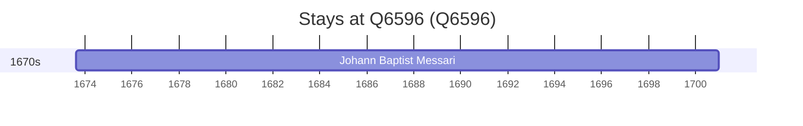

# Q6596

*(fetch error: HTTP Error 429: Too Many Requests)*

Wikidata: [Q6596](https://www.wikidata.org/wiki/Q6596)

1 occurrence(s) across 1 transcribed value(s), 1 person(s).

**Transcribed variants:**

- `Gorizia` (1×, 1673–1673)

| Date | Variant | Person | Type | Entity id | Real entity |
|------|---------|--------|------|-----------|-------------|
| 1673-08-12 | Gorizia | Johann Baptist Messari | nascimento | [deh-johann-baptist-messari](deh-johann-baptist-messari) | — |

