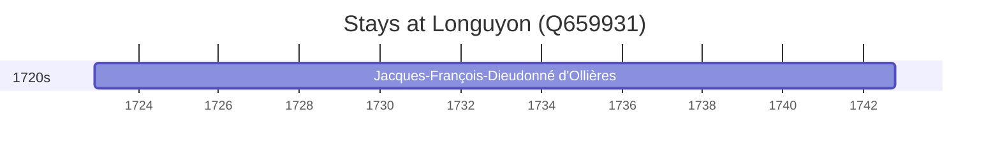

# Longuyon (Q659931)

*commune in Meurthe-et-Moselle, France*

Wikidata: [Q659931](https://www.wikidata.org/wiki/Q659931)

1 occurrence(s) across 1 transcribed value(s), 1 person(s).

**Transcribed variants:**

- `Longuyon, diocese de Trier (Meurthe-et-Moselle)` (1×, 1722–1722)

| Date | Variant | Person | Type | Entity id | Real entity |
|------|---------|--------|------|-----------|-------------|
| 1722-12-02 | Longuyon, diocese de Trier (Meurthe-et-Moselle) | Jacques-François-Dieudonné d'Ollières | nascimento | [deh-jacques-francois-dieudonne-dollieres](deh-jacques-francois-dieudonne-dollieres) | — |

