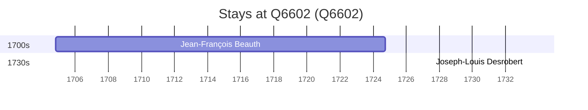

# Q6602

*(fetch error: HTTP Error 429: Too Many Requests)*

Wikidata: [Q6602](https://www.wikidata.org/wiki/Q6602)

2 occurrence(s) across 1 transcribed value(s), 2 person(s).

**Transcribed variants:**

- `Strasbourg` (2×, 1704–1733)

| Date | Variant | Person | Type | Entity id | Real entity |
|------|---------|--------|------|-----------|-------------|
| 1704-10-26 | Strasbourg | Jean-François Beauth | nascimento | [deh-jean-francois-beauth](deh-jean-francois-beauth) | — |
| 1733-04-04 | Strasbourg | Joseph-Louis Desrobert | jesuita-ordenacao-padre | [deh-joseph-louis-desrobert](deh-joseph-louis-desrobert) | — |

