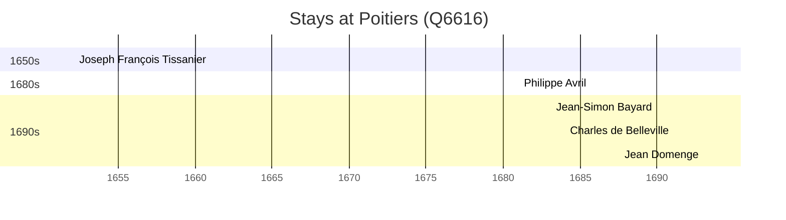

# Poitiers (Q6616)

*commune in Vienne, France*

Wikidata: [Q6616](https://www.wikidata.org/wiki/Q6616)

6 occurrence(s) across 1 transcribed value(s), 5 person(s).

**Transcribed variants:**

- `Poitiers` (6×, 1652–1693)

| Date | Variant | Person | Type | Entity id | Real entity |
|------|---------|--------|------|-----------|-------------|
| — | Poitiers | Joseph François Tissanier | estadia | [deh-joseph-francois-tissanier](deh-joseph-francois-tissanier) | — |
| 1652-03-03 | Poitiers | Joseph François Tissanier | jesuita-votos-local | [deh-joseph-francois-tissanier](deh-joseph-francois-tissanier) | — |
| 1681 | Poitiers | Philippe Avril | jesuita-ordenacao-padre | [deh-philippe-avril](deh-philippe-avril) | [rp636254](rp636254) |
| 1690 | Poitiers | Jean-Simon Bayard | jesuita-ordenacao-padre | [deh-jean-simon-bayard](deh-jean-simon-bayard) | — |
| 1691-02-02 | Poitiers | Charles de Belleville | jesuita-votos-local | [deh-charles-de-belleville](deh-charles-de-belleville) | [rp033271](rp033271) |
| 1693 | Poitiers | Jean Domenge | jesuita-ordenacao-padre | [deh-jean-domenge](deh-jean-domenge) | — |

