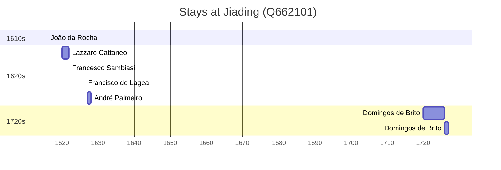

# Jiading (Q662101)

*district of Shanghai, China, and former separate city*

Wikidata: [Q662101](https://www.wikidata.org/wiki/Q662101)

9 occurrence(s) across 3 transcribed value(s), 8 person(s).

**Transcribed variants:**

- `Kiating` (5×, 1620–1627)
- `Kiatim (Kiating) do Kiangnan` (1×, 1626–1626)
- `Kiating, Kiangnan` (3×, 1720–1726)

| Date | Variant | Person | Type | Entity id | Real entity |
|------|---------|--------|------|-----------|-------------|
| — | Kiating, Kiangnan | Francisco Furtado | estadia | [deh-francisco-furtado](deh-francisco-furtado) | — |
| — | Kiating | Johann Terrenz Schreck | estadia | [deh-johann-terrenz-schreck](deh-johann-terrenz-schreck) | — |
| 1620 | Kiating | Lazzaro Cattaneo | estadia | [deh-lazzaro-cattaneo](deh-lazzaro-cattaneo) | — |
| 1622 | Kiating | Francesco Sambiasi | estadia | [deh-francesco-sambiasi](deh-francesco-sambiasi) | — |
| 1626-04-12 | Kiatim (Kiating) do Kiangnan | Francisco de Lagea | jesuita-votos-local | [deh-francisco-de-lagea](deh-francisco-de-lagea) | — |
| 1627 | Kiating | André Palmeiro | estadia | [deh-andre-palmeiro](deh-andre-palmeiro) | [rp983183](rp983183) |
| 1720 | Kiating, Kiangnan | Domingos de Brito | estadia | [deh-domingos-de-brito](deh-domingos-de-brito) | — |
| 1726 | Kiating, Kiangnan | Domingos de Brito | estadia | [deh-domingos-de-brito](deh-domingos-de-brito) | — |
| >1616 | Kiating | João da Rocha | estadia | [deh-joao-da-rocha](deh-joao-da-rocha) | — |

