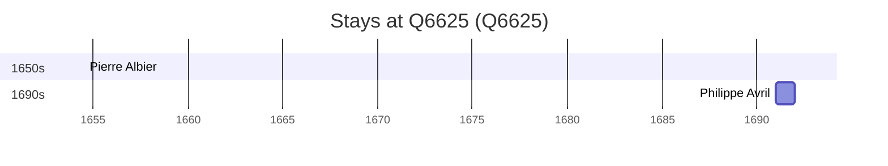

# Q6625

*(fetch error: HTTP Error 429: Too Many Requests)*

Wikidata: [Q6625](https://www.wikidata.org/wiki/Q6625)

2 occurrence(s) across 1 transcribed value(s), 2 person(s).

**Transcribed variants:**

- `Agen` (2×, 1654–1691)

| Date | Variant | Person | Type | Entity id | Real entity |
|------|---------|--------|------|-----------|-------------|
| 1654-07-12 | Agen | Pierre Albier | jesuita-votos-local | [deh-pierre-albier](deh-pierre-albier) | — |
| 1691 | Agen | Philippe Avril | estadia | [deh-philippe-avril](deh-philippe-avril) | [rp636254](rp636254) |

