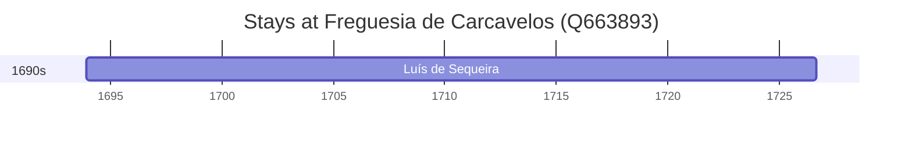

# Freguesia de Carcavelos (Q663893)

*former civil parish in Portugal*

Wikidata: [Q663893](https://www.wikidata.org/wiki/Q663893)

1 occurrence(s) across 1 transcribed value(s), 1 person(s).

**Transcribed variants:**

- `Carcavelos` (1×, 1693–1693)

| Date | Variant | Person | Type | Entity id | Real entity |
|------|---------|--------|------|-----------|-------------|
| 1693-12-04 | Carcavelos | Luís de Sequeira | nascimento | [deh-luis-de-sequeira](deh-luis-de-sequeira) | — |

