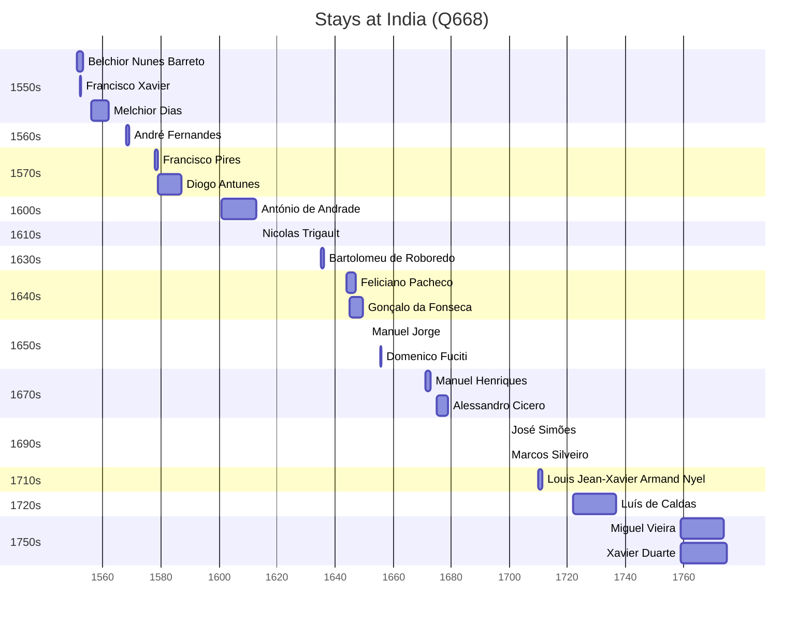

# India (Q668)

*country in South Asia*

Wikidata: [Q668](https://www.wikidata.org/wiki/Q668)

37 occurrence(s) across 2 transcribed value(s), 34 person(s).

**Transcribed variants:**

- `Índia` (34×, 1551–1722)
- `Índia (Residência de Verem)` (3×, 1759–1760)

| Date | Variant | Person | Type | Entity id | Real entity |
|------|---------|--------|------|-----------|-------------|
| — | Índia | Antonio Díaz | estadia | [deh-antonio-diaz](deh-antonio-diaz) | — |
| — | Índia | Bernard Rodes | estadia | [deh-bernard-rodes](deh-bernard-rodes) | — |
| — | Índia | Camillo di Costanzo | chegada | [deh-camillo-di-costanzo](deh-camillo-di-costanzo) | — |
| — | Índia | Francisco Simões | estadia | [deh-francisco-simoes](deh-francisco-simoes) | — |
| — | Índia | François de Rougemont | chegada | [deh-francois-de-rougemont](deh-francois-de-rougemont) | — |
| — | Índia | Jean Noëllas | chegada | [deh-jean-noellas](deh-jean-noellas) | — |
| — | Índia | Julien-Placide Hervieu | estadia | [deh-julien-placide-hervieu](deh-julien-placide-hervieu) | — |
| — | Índia | Manuel de Sá | estadia | [deh-manuel-de-sa](deh-manuel-de-sa) | — |
| — | Índia | Manuel Lopes Bulhão | estadia | [deh-manuel-lopes-ref1](deh-manuel-lopes-ref1) | — |
| — | Índia | Gonçalo Álvares | estadia | [deh-manuel-lopes-ref2](deh-manuel-lopes-ref2) | — |
| 1551 | Índia | Belchior Nunes Barreto | estadia | [deh-belchior-nunes-barreto](deh-belchior-nunes-barreto) | [rp606650](rp606650) |
| 1552 | Índia | Francisco Pérez | estadia | [deh-francisco-perez](deh-francisco-perez) | [rp892854](rp892854) |
| 1552-01-24 | Índia | Francisco Xavier | estadia | [deh-francisco-xavier](deh-francisco-xavier) | — |
| 1556 | Índia | Melchior Dias | estadia | [deh-melchor-diaz-ref1](deh-melchor-diaz-ref1) | — |
| 1557 | Índia | Melchior Dias | estadia | [deh-melchor-diaz-ref1](deh-melchor-diaz-ref1) | — |
| 1577-10 | Índia | Melchior Dias | partida | [deh-melchor-diaz-ref1](deh-melchor-diaz-ref1) | — |
| 1578 | Índia | Francisco Pires | estadia | [deh-francisco-pires](deh-francisco-pires) | — |
| 1579 | Índia | Diogo Antunes | estadia | [deh-diogo-antunes](deh-diogo-antunes) | — |
| 1600-10-02 | Índia | António de Andrade | estadia | [deh-antonio-de-andrade](deh-antonio-de-andrade) | — |
| 1635 | Índia | Bartolomeu de Roboredo | estadia | [deh-bartolomeu-de-roboredo](deh-bartolomeu-de-roboredo) | — |
| 1641 | Índia | Carlo Della Rocca | partida | [deh-carlo-della-rocca](deh-carlo-della-rocca) | — |
| 1644 | Índia | Feliciano Pacheco | estadia | [deh-feliciano-pacheco](deh-feliciano-pacheco) | — |
| 1645 | Índia | Gonçalo da Fonseca | estadia | [deh-goncalo-da-fonseca](deh-goncalo-da-fonseca) | — |
| 1651 | Índia | Manuel Jorge | jesuita-ordenacao-padre | [deh-manuel-jorge](deh-manuel-jorge) | — |
| 1655-08 | Índia | Domenico Fuciti | chegada | [deh-domenico-fuciti](deh-domenico-fuciti) | — |
| 1671 | Índia | Manuel Henriques | estadia | [deh-manuel-henriques](deh-manuel-henriques) | — |
| 1675 | Índia | Alessandro Cicero | chegada | [deh-alessandro-cicero](deh-alessandro-cicero) | [rp532453](rp532453) |
| 1699 | Índia | José Simões | jesuita-ordenacao-padre | [deh-jose-simoes](deh-jose-simoes) | — |
| 1699 | Índia | Marcos Silveiro | jesuita-ordenacao-padre | [deh-marcos-silveiro](deh-marcos-silveiro) | — |
| 1710 | Índia | Louis Jean-Xavier Armand Nyel | estadia | [deh-louis-jean-xavier-armand-nyel](deh-louis-jean-xavier-armand-nyel) | — |
| 1720-01-14 | Índia | Joseph Labbe | partida | [deh-joseph-labbe](deh-joseph-labbe) | — |
| 1722 | Índia | Luís de Caldas | estadia | [deh-luis-de-caldas](deh-luis-de-caldas) | — |
| 1759 | Índia (Residência de Verem) | Miguel Vieira | estadia | [deh-miguel-vieira](deh-miguel-vieira) | — |
| 1759 | Índia (Residência de Verem) | Xavier Duarte | estadia | [deh-xavier-duarte](deh-xavier-duarte) | — |
| 1760-10 | Índia (Residência de Verem) | Miguel Vieira | estadia | [deh-miguel-vieira](deh-miguel-vieira) | — |
| <1568: | Índia | André Fernandes | estadia | [deh-andre-fernandes-i](deh-andre-fernandes-i) | — |
| >1613-02-09 | Índia | Nicolas Trigault | estadia | [deh-nicolas-trigault](deh-nicolas-trigault) | — |

### Co-presence

These persons were plausibly at this place during overlapping periods (interval estimation from stay dates; rough — see method note below).

| Period | Persons |
|--------|---------|
| 1550s | [Belchior Nunes Barreto](rp606650), [Francisco Xavier](deh-francisco-xavier) |
| 1570s | [Diogo Antunes](deh-diogo-antunes), [Francisco Pires](deh-francisco-pires) |
| 1640s | [Feliciano Pacheco](deh-feliciano-pacheco), [Gonçalo da Fonseca](deh-goncalo-da-fonseca) |

*3 overlapping pair(s) involving 6 person(s). Method: interval start = stay event date; end = next embarque/partida/different-place event, or death, or +15yr cap.*

