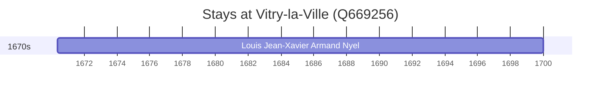

# Vitry-la-Ville (Q669256)

*commune in Marne, France*

Wikidata: [Q669256](https://www.wikidata.org/wiki/Q669256)

1 occurrence(s) across 1 transcribed value(s), 1 person(s).

**Transcribed variants:**

- `Vitry` (1×, 1670–1670)

| Date | Variant | Person | Type | Entity id | Real entity |
|------|---------|--------|------|-----------|-------------|
| 1670-05-17 | Vitry | Louis Jean-Xavier Armand Nyel | nascimento | [deh-louis-jean-xavier-armand-nyel](deh-louis-jean-xavier-armand-nyel) | — |

