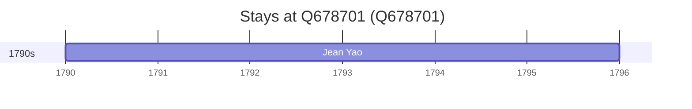

# Q678701

*(fetch error: HTTP Error 429: Too Many Requests)*

Wikidata: [Q678701](https://www.wikidata.org/wiki/Q678701)

2 occurrence(s) across 1 transcribed value(s), 1 person(s).

**Transcribed variants:**

- `Haimen, Kiang-sou` (2×, 1790–1792)

| Date | Variant | Person | Type | Entity id | Real entity |
|------|---------|--------|------|-----------|-------------|
| 1790 | Haimen, Kiang-sou | Jean Yao | estadia | [deh-jean-yao](deh-jean-yao) | — |
| 1792 | Haimen, Kiang-sou | Jean Yao | estadia | [deh-jean-yao](deh-jean-yao) | — |

