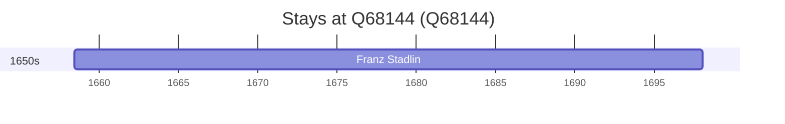

# Q68144

*(fetch error: HTTP Error 429: Too Many Requests)*

Wikidata: [Q68144](https://www.wikidata.org/wiki/Q68144)

1 occurrence(s) across 1 transcribed value(s), 1 person(s).

**Transcribed variants:**

- `Zug, Suíça` (1×, 1658–1658)

| Date | Variant | Person | Type | Entity id | Real entity |
|------|---------|--------|------|-----------|-------------|
| 1658-06-18 | Zug, Suíça | Franz Stadlin | nascimento | [deh-franz-stadlin](deh-franz-stadlin) | — |

