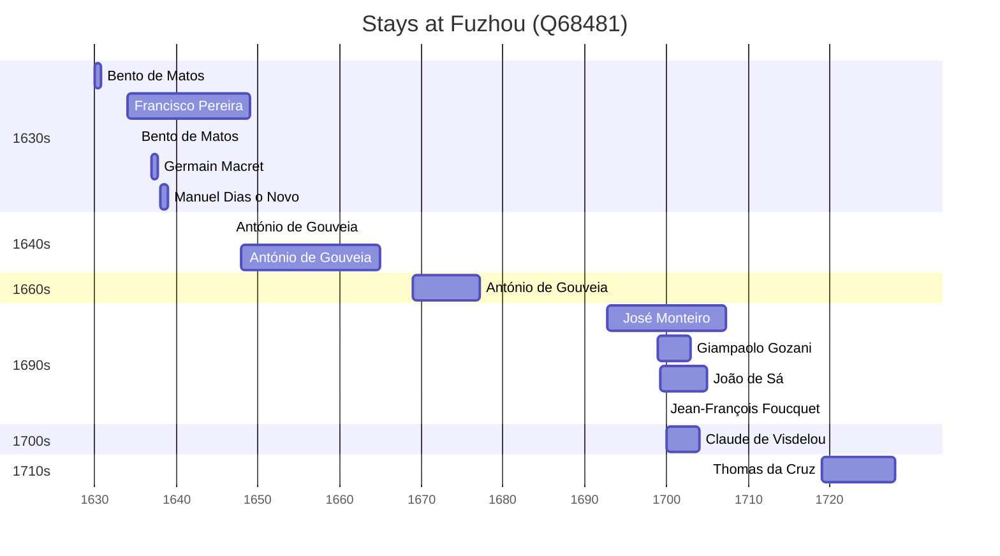

# Fuzhou (Q68481)

*capital city of Fujian province, China*

Wikidata: [Q68481](https://www.wikidata.org/wiki/Q68481)

26 occurrence(s) across 11 transcribed value(s), 14 person(s).

**Transcribed variants:**

- `Foochow` (6×, 1630–1700)
- `Foochow, Fukien` (10×, 1634–1725)
- `Foochow fou, Fukien` (1×, 1638–1638)
- `Fukien` (1×, 1646–1646)
- `Foochow (Fou-tcheou fou, Fukien)` (1×, 1661–1661)
- `Fou-tcheou fou` (1×, 1676–1676)
- `Foochow (Fou-tcheou fou), Fukien` (1×, 1692–1692)
- `Foochow, Fou-kien` (2×, 1699–1702)
- `Foochow, Fukien (residência)` (1×, 1699–1699)
- `Foochow, Fou-tcheou fu, Fukien` (1×, 1714–1714)
- `Wuchang (Wou-tch'ang fou)` (1×, undated)

| Date | Variant | Person | Type | Entity id | Real entity |
|------|---------|--------|------|-----------|-------------|
| — | Foochow | Giovanni Laureati | estadia | [deh-giovanni-laureati](deh-giovanni-laureati) | [rp323905](rp323905) |
| 1630 | Foochow | Bento de Matos | estadia | [deh-bento-de-matos](deh-bento-de-matos) | — |
| 1634 | Foochow, Fukien | Francisco Pereira | estadia | [deh-francisco-pereira](deh-francisco-pereira) | — |
| 1635 | Foochow | Bento de Matos | estadia | [deh-bento-de-matos](deh-bento-de-matos) | — |
| 1637 | Foochow | Germain Macret | estadia | [deh-germain-macret](deh-germain-macret) | — |
| 1638 | Foochow fou, Fukien | Manuel Dias, o Novo | estadia | [deh-manuel-dias-o-novo](deh-manuel-dias-o-novo) | — |
| 1646-07-14 | Fukien | António de Gouveia | jesuita-votos-local | [deh-antonio-de-gouvea](deh-antonio-de-gouvea) | — |
| 1656 | Foochow, Fukien | António de Gouveia | estadia | [deh-antonio-de-gouvea](deh-antonio-de-gouvea) | — |
| 1661 | Foochow (Fou-tcheou fou, Fukien) | André Ferrão | morte | [deh-andre-ferrao](deh-andre-ferrao) | [rp773563](rp773563) |
| 1665 | Foochow, Fukien | António de Gouveia | estadia | [deh-antonio-de-gouvea](deh-antonio-de-gouvea) | — |
| 1669 | Foochow, Fukien | António de Gouveia | estadia | [deh-antonio-de-gouvea](deh-antonio-de-gouvea) | — |
| 1672 | Foochow, Fukien | António de Gouveia | estadia | [deh-antonio-de-gouvea](deh-antonio-de-gouvea) | — |
| 1676-09-04 | Fou-tcheou fou | Germain Macret | morte | [deh-germain-macret](deh-germain-macret) | — |
| 1677-02-14 | Foochow, Fukien | António de Gouveia | morte | [deh-antonio-de-gouvea](deh-antonio-de-gouvea) | — |
| 1692-09-13 | Foochow (Fou-tcheou fou), Fukien | José Monteiro | estadia | [deh-jose-monteiro](deh-jose-monteiro) | — |
| 1699 | Foochow, Fou-kien | Giampaolo Gozani | estadia | [deh-giampaolo-gozani](deh-giampaolo-gozani) | — |
| 1699-04 | Foochow, Fukien | João de Sá | estadia | [deh-joao-de-sa](deh-joao-de-sa) | — |
| 1699-09-08 | Foochow, Fukien (residência) | Jean-François Foucquet | jesuita-votos-local | [deh-jean-francois-foucquet](deh-jean-francois-foucquet) | — |
| 1700 | Foochow | Claude de Visdelou | estadia | [deh-claude-de-visdelou](deh-claude-de-visdelou) | — |
| 1700-11-21 | Foochow | Giampaolo Gozani | jesuita-votos-local | [deh-giampaolo-gozani](deh-giampaolo-gozani) | — |
| 1702 | Foochow, Fou-kien | Giampaolo Gozani | estadia | [deh-giampaolo-gozani](deh-giampaolo-gozani) | — |
| 1703 | Foochow, Fukien | João de Sá | estadia | [deh-joao-de-sa](deh-joao-de-sa) | — |
| 1714 | Foochow, Fou-tcheou fu, Fukien | de Zea | estadia | [deh-de-zea](deh-de-zea) | [rp323905](rp323905) |
| 1719 | Foochow, Fukien | Thomas da Cruz | estadia | [deh-thomas-da-cruz](deh-thomas-da-cruz) | — |
| 1725 | Foochow, Fukien | Thomas da Cruz | estadia | [deh-thomas-da-cruz](deh-thomas-da-cruz) | — |
| <1648 | Wuchang (Wou-tch'ang fou) | António de Gouveia | estadia | [deh-antonio-de-gouvea](deh-antonio-de-gouvea) | — |

### Co-presence

These persons were plausibly at this place during overlapping periods (interval estimation from stay dates; rough — see method note below).

| Period | Persons |
|--------|---------|
| 1690s | [Giampaolo Gozani](deh-giampaolo-gozani), [Jean-François Foucquet](deh-jean-francois-foucquet), [José Monteiro](deh-jose-monteiro), [João de Sá](deh-joao-de-sa) |
| 1700s | [Claude de Visdelou](deh-claude-de-visdelou), [Giampaolo Gozani](deh-giampaolo-gozani), [José Monteiro](deh-jose-monteiro), [João de Sá](deh-joao-de-sa) |

*9 overlapping pair(s) involving 5 person(s). Method: interval start = stay event date; end = next embarque/partida/different-place event, or death, or +15yr cap.*

