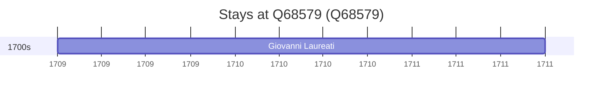

# Q68579

*(fetch error: HTTP Error 429: Too Many Requests)*

Wikidata: [Q68579](https://www.wikidata.org/wiki/Q68579)

1 occurrence(s) across 1 transcribed value(s), 1 person(s).

**Transcribed variants:**

- `Hinghwa, Fukien` (1×, 1709–1709)

| Date | Variant | Person | Type | Entity id | Real entity |
|------|---------|--------|------|-----------|-------------|
| 1709 | Hinghwa, Fukien | Giovanni Laureati | estadia | [deh-giovanni-laureati](deh-giovanni-laureati) | [rp323905](rp323905) |

