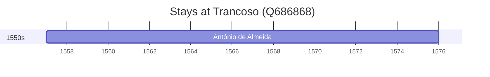

# Trancoso (Q686868)

*municipality in Portugal*

Wikidata: [Q686868](https://www.wikidata.org/wiki/Q686868)

1 occurrence(s) across 1 transcribed value(s), 1 person(s).

**Transcribed variants:**

- `Trancoso, diocese de Viseu` (1×, 1557–1557)

| Date | Variant | Person | Type | Entity id | Real entity |
|------|---------|--------|------|-----------|-------------|
| 1557 | Trancoso, diocese de Viseu | António de Almeida | nascimento | [deh-antonio-de-almeida](deh-antonio-de-almeida) | — |

