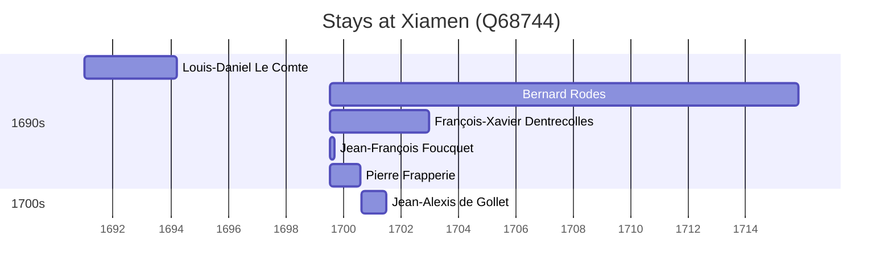

# Xiamen (Q68744)

*prefecture-level city in Fujian, China*

Wikidata: [Q68744](https://www.wikidata.org/wiki/Q68744)

7 occurrence(s) across 1 transcribed value(s), 7 person(s).

**Transcribed variants:**

- `Amoy, Fukien` (7×, 1691–1700)

| Date | Variant | Person | Type | Entity id | Real entity |
|------|---------|--------|------|-----------|-------------|
| — | Amoy, Fukien | Giovanni Laureati | estadia | [deh-giovanni-laureati](deh-giovanni-laureati) | [rp323905](rp323905) |
| 1691 | Amoy, Fukien | Louis-Daniel Le Comte | estadia | [deh-louis-daniel-le-comte](deh-louis-daniel-le-comte) | — |
| 1699-07-24 | Amoy, Fukien | Bernard Rodes | estadia | [deh-bernard-rodes](deh-bernard-rodes) | — |
| 1699-07-24 | Amoy, Fukien | François-Xavier Dentrecolles | chegada | [deh-francois-xavier-dentrecolles](deh-francois-xavier-dentrecolles) | — |
| 1699-07-24 | Amoy, Fukien | Jean-François Foucquet | chegada | [deh-jean-francois-foucquet](deh-jean-francois-foucquet) | — |
| 1699-07-24 | Amoy, Fukien | Pierre Frapperie | chegada | [deh-pierre-frapperie](deh-pierre-frapperie) | — |
| 1700-08-23 | Amoy, Fukien | Jean-Alexis de Gollet | estadia | [deh-jean-alexis-de-gollet](deh-jean-alexis-de-gollet) | — |

### Co-presence

These persons were plausibly at this place during overlapping periods (interval estimation from stay dates; rough — see method note below).

| Period | Persons |
|--------|---------|
| 1690s | [Bernard Rodes](deh-bernard-rodes), [François-Xavier Dentrecolles](deh-francois-xavier-dentrecolles), [Jean-François Foucquet](deh-jean-francois-foucquet), [Pierre Frapperie](deh-pierre-frapperie) |
| 1700s | [Bernard Rodes](deh-bernard-rodes), [François-Xavier Dentrecolles](deh-francois-xavier-dentrecolles), [Jean-Alexis de Gollet](deh-jean-alexis-de-gollet) |

*8 overlapping pair(s) involving 5 person(s). Method: interval start = stay event date; end = next embarque/partida/different-place event, or death, or +15yr cap.*

